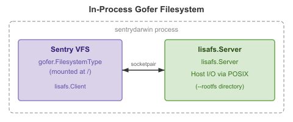

# gVisor macOS Port

> **Status: Functional — full interactive shell with devpts PTY and job control**
>
> gVisor runs on macOS Apple Silicon via Hypervisor.framework. Alpine
> Linux boots with full shell, networking, package management, and
> multi-CPU support. 68+ packages installed and tested. Dynamically-linked
> binaries (jq, curl, etc.) run reliably with 1000+ sequential exec cycles.
> Interactive shell uses devpts PTY with proper line discipline, echo,
> signals (Ctrl+C/Ctrl+Z), and job control (bg/fg).

| Feature | Status |
|---------|--------|
| HVF platform (Hypervisor.framework) | Working |
| ARM64 page tables (4K default, per-MM, COW) | Working |
| Fork/exec with copy-on-write | Working |
| Signal delivery (SIGURG, SIGINT, etc.) | Working |
| Multi-CPU (14 vCPUs, GOMAXPROCS=22) | Working |
| Gofer filesystem (host dir passthrough) | Working |
| Symlink resolution (busybox) | Working |
| Alpine Linux 3.21.3 | Working |
| TCP/UDP (loopback + internet) | Working |
| Host networking (proxy, default) | Working (no root, no daemon) |
| Host networking (utun + userspace proxy) | Working (requires root) |
| Host networking (vmnet via socket_vmnet) | Working (rootless, needs daemon) |
| DNS resolution (host system DNS) | Working |
| HTTP/HTTPS downloads | Working (up to 17MB verified) |
| Package install (`apk add`) | Working (68+ packages) |
| Installed packages | Working — 50/50 test pass rate |
| TLB maintenance at EL1 | Working (TLBI ASIDE1IS on every guest entry) |
| VDSO (clock_gettime fast path) | Working (~5ns/call via CNTVCT_EL0) |
| directfs mode (bypass lisafs RPC) | Working (`--directfs` flag) |
| ICMP ping (unprivileged) | Working (SOCK_DGRAM, no raw socket) |
| safecopy (Mach exception ports) | Working (bypasses PAC sigreturn) |
| devpts PTY (interactive shell, job control) | Working (bg/fg/Ctrl+Z/Ctrl+C) |
| MRS ID register emulation (trap-and-emulate) | Working |
| EL0 cache maintenance (DC CIVAC, CTR_EL0) | Working (SCTLR_EL1 UCI/UCT) |
| 4K guest pages (default) | Working (IPA granule 4K, TG0=4K) |
| Split page model (4K guest / 16K host) | Working (74/77 Alpine tests) |
| GraalVM Native Image (Java AOT) | Working |
| FEX-Emu (x86_64 emulation) | Partial — not retested since the [fault loop](docs/FEX-EMU.md) fix |
| Java / JVM (HotSpot JIT) | Blocked — [upstream JDK bug](docs/MRS-TRAPPING.md) |

## Quick Start

```bash
# Build (requires pure=false for CGO/Hypervisor.framework)
bazel build //cmd/sentrydarwin --@io_bazel_rules_go//go/config:pure=false

# Sign with Hypervisor entitlement
cp bazel-bin/cmd/sentrydarwin/sentrydarwin_/sentrydarwin ./sentrydarwin
codesign --entitlements cmd/sentrydarwin/entitlements.plist -f --sign - ./sentrydarwin

# Download Alpine Linux rootfs
mkdir alpine-rootfs
curl -sL https://dl-cdn.alpinelinux.org/alpine/v3.21/releases/aarch64/alpine-minirootfs-3.21.3-aarch64.tar.gz \
  | tar xz -C alpine-rootfs

# Run
./sentrydarwin --rootfs alpine-rootfs /bin/sh -c 'ls /; cat /etc/os-release'

# With host networking (no root needed)
./sentrydarwin --net --rootfs alpine-rootfs /bin/sh -c 'ping -c2 8.8.8.8'
```

Or build with Bazel (handles CGo and dependencies):

```bash
bazel build --config=hvf //cmd/sentrydarwin
cp bazel-bin/cmd/sentrydarwin/sentrydarwin_/sentrydarwin .
codesign -s - --entitlements cmd/sentrydarwin/entitlements.plist -f sentrydarwin
```

Or build with Nix; this runs the same Bazel build (nixpkgs' Bazel 8, the
macOS 26 SDK) and signs the binary with the Hypervisor entitlement:

```bash
nix build .#sentrydarwin   # result/bin/sentrydarwin
```

The flake (flake-parts; one module per feature under `nix/`) fetches Bazel's
external repositories once, with `bazel vendor`, into a fixed-output
derivation, then builds offline. Nix reuses that derivation until its hash
changes, so after changing `MODULE.bazel`, `go.mod` or `go.sum`, set
`outputHash` in `nix/sentrydarwin.nix` to `lib.fakeHash`, build, and paste the
hash Nix reports. Nix only sees files tracked by git (`git add -N` new files).

### Flags

| Flag | Description |
|------|-------------|
| `--rootfs <dir>` | Host directory to use as guest root filesystem (via gofer) |
| `--nix-store <dir>` | Mount the host Nix store read-only at guest `/nix/store` (default: `/nix/store`; empty disables) |
| `--nix-store-overlay` | Make guest `/nix/store` writable: the host store is the read-only lower layer of an overlay whose upper layer is in-memory tmpfs. Guest builds never reach the host store and are discarded on exit |
| `--nix-build` | Run the Nix derivation build described by the `build.json` given as the final argument (Nix's `external-builders` protocol; see [Building with Nix](#building-with-nix)) |
| `--nix-build-sh <path>` | With `--nix-build`, make guest `/bin/sh` a symlink to `<path>`, e.g. a static busybox in the Nix store |
| `--cwd` | Mount the host working directory read-write at the same guest path and start there (default: on; ignored with `--rootfs`; `--cwd=false` disables) |
| `--home` | Mount `$HOME` read-write at the same guest path and set the guest `HOME` to it |
| `--mount <host>[:<guest>][:ro\|:rw]` | Mount a host directory in the guest (guest path defaults to the host path; read-write unless `:ro`; repeatable) |
| `--net`, `--net=proxy` | Enable host networking via userspace proxy (default, no root) |
| `--net=utun` | Enable host networking via utun (requires root) |
| `--net=vmnet` | Enable host networking via socket_vmnet (no root, needs daemon) |
| `--guest-ip <ip>` | Guest IP address for vmnet mode (default: 192.168.105.100) |
| `--vmnet-socket <path>` | socket_vmnet Unix socket path (default: auto-detect) |
| `--strace` | Enable system call tracing |
| `--directfs` | Enable directfs mode (bypass lisafs RPC for host file access) |
| `--cpus <n>` | Number of vCPUs (0 = auto-detect, default) |
| `--keep-root` | Keep root privileges after utun setup (default: drop to SUDO_UID) |
| `--page4k` | Use 4K guest pages (default: on). Linux ARM64 standard. |
| `--profile <file>` | Write per-Switch() timing stats to file on exit. |
| `--page16k` | Use 16K guest pages (macOS native). Disables 4K mode. |

## Usage Examples

### Basic commands

```console
$ sentrydarwin --rootfs alpine-rootfs /bin/sh -c 'uname -a'
Linux gvisor-darwin 4.4.0 #1 SMP Sun Jan 10 15:06:54 PST 2016 aarch64 Linux

$ sentrydarwin --rootfs alpine-rootfs /bin/sh -c 'cat /etc/alpine-release'
3.21.3

$ sentrydarwin --rootfs alpine-rootfs /bin/sh -c 'id'
uid=0(root) gid=0(root)

$ sentrydarwin --rootfs alpine-rootfs /bin/sh -c 'ls /'
bin dev etc home lib media mnt opt proc root run sbin srv sys tmp usr var
```

### Shell scripts with fork, exec, and pipes

```console
$ sentrydarwin --rootfs alpine-rootfs /bin/sh -c '
    echo "Files in /bin: $(ls /bin | wc -l)"
    echo "Hello" | tr a-z A-Z
    seq 1 5 | awk "{s+=\$1} END{print \"Sum:\", s}"
'
Files in /bin: 82
HELLO
Sum: 15
```

### File I/O

```console
$ sentrydarwin --rootfs alpine-rootfs /bin/sh -c '
    echo "gVisor on macOS" > /tmp/test.txt
    cat /tmp/test.txt
    wc -c /tmp/test.txt
'
gVisor on macOS
16 /tmp/test.txt
```

### Host networking (no root needed)

```console
$ sentrydarwin --net --rootfs alpine-rootfs /bin/sh -c 'ping -c 2 8.8.8.8'
PING 8.8.8.8 (8.8.8.8): 56 data bytes
64 bytes from 8.8.8.8: seq=0 ttl=110 time=3.957 ms
64 bytes from 8.8.8.8: seq=1 ttl=110 time=4.123 ms
```

### Syscall tracing

```console
$ sentrydarwin --strace --rootfs alpine-rootfs /bin/sh -c 'echo hello' 2>&1 | grep -E "write|exit"
[   1:   1] sh X write(0x1, ..., 0x6) = 6
[   1:   1] sh E exit_group(0x0)
```

### Running Go binaries directly (no rootfs needed)

```console
$ sentrydarwin ./my-static-linux-arm64-binary arg1 arg2
```

### Sharing host directories

Without `--rootfs`, the guest root is an empty tmpfs plus `/nix/store`,
`/proc`, `/dev`, and `/tmp`. The host working directory is mounted at its host
path and the guest starts there, so relative paths behave as on the host:

```console
$ cd ~/src/project
$ sentrydarwin /nix/store/...-eza-0.23.5/bin/eza -l src
$ sentrydarwin --home /nix/store/...-busybox/bin/busybox sh -c 'echo $HOME; pwd'
/Users/me
/Users/me/src/project
$ sentrydarwin --mount ~/data:/data:ro --mount /Volumes/scratch ./tool
```

Host paths keep their host names in the guest (for example
`/Users/me/src/project`); a working directory already visible through another
mount (`--home`, `--mount`, or `/nix/store`) is not mounted again. Mounts over
`/`, `/proc`, or `/dev` are rejected. Directories protected by macOS privacy
settings (such as `~/Documents`) fail with "operation not permitted" unless the
terminal has access to them.

### A tool environment

The empty guest root has no `/bin/sh`, `/usr/bin/env` or anything on `PATH`.
[`nix/sandbox.nix`](nix/sandbox.nix) builds a Linux tool environment (bash,
coreutils, git, ripgrep, fd, procps, ncurses' terminfo, ...) and a wrapper,
`sb`, that puts it on `PATH`, sets `SHELL`, links `/bin/sh` and `/usr/bin/env`
into the guest root, trusts all git repositories (shared files belong to your
uid while the guest runs as root), and runs a command (default: a login bash).
The flake's `sb` app starts `sb` under `sentrydarwin` (from `PATH`, or
`$SENTRYDARWIN`, with extra flags from `$SENTRYDARWIN_FLAGS`); building it
needs the [Nix builder](#building-with-nix):

```console
$ nix run .#sb                            # login bash
$ SENTRYDARWIN_FLAGS="--mount $HOME/src/project:ro" nix run .#sb -- git -C ~/src/project log -1
$ nix build .#packages.aarch64-linux.sb -o sb && sentrydarwin ./sb/bin/sb
```

### Building with Nix

sentrydarwin can be Nix's builder for `aarch64-linux`, so that the host's own
`nix build` builds Linux derivations:

```console
$ nix build nixpkgs#legacyPackages.aarch64-linux.hello
```

Host Nix evaluates, substitutes and registers paths as usual. For each
`aarch64-linux` derivation it runs `sentrydarwin --nix-build BUILD_JSON`
(the [`external-builders`](https://determinate.systems/blog/changelog-determinate-nix-384/)
protocol of Determinate Nix). sentrydarwin then:

- mounts the host store at `/nix/store` behind an in-memory copy-on-write
  layer, so the builder can read every store path but not modify one;
- shares the host build directory at `/build` and creates the `/etc/passwd`,
  `/etc/group` and `/etc/hosts` that Nix's Linux sandbox provides, plus
  `/bin/sh` (`--nix-build-sh`);
- runs the builder as root in the guest, with exactly Nix's environment and
  loopback-only networking, except for fixed-output derivations (fetchers),
  which get the proxy network and the host's `/etc/resolv.conf`;
- copies the declared outputs from the copy-on-write layer into the store
  and exits with the builder's status.

Sentry messages go to `sentrydarwin.log` in the build's top directory (kept
with `--keep-failed`) instead of the build log.

Setup, with the Nix daemon (edit `/etc/nix/nix.custom.conf` on Determinate
Nix, `/etc/nix/nix.conf` otherwise):

```console
# The daemon starts builders as a build user (e.g. _nixbld12), which cannot
# read your home directory: install the binary elsewhere (install keeps the
# signature). Also a /bin/sh for builders, kept alive by a GC root.
$ sudo install -m 755 ./sentrydarwin /usr/local/bin/sentrydarwin
$ nix build --out-link ~/.local/state/sentrydarwin-sh \
    nixpkgs#legacyPackages.aarch64-linux.pkgsStatic.busybox
$ readlink ~/.local/state/sentrydarwin-sh    # /nix/store/...-busybox-static-...

# nix.custom.conf
extra-experimental-features = external-builders
external-builders = [{"systems":["aarch64-linux"],"program":"/usr/local/bin/sentrydarwin","args":["--nix-build","--nix-build-sh=/nix/store/...-busybox-static-aarch64-unknown-linux-musl-1.37.0/bin/busybox"]}]

$ sudo launchctl kickstart -k system/systems.determinate.nix-daemon
```

Without changing the daemon, the same works with a local store you own,
e.g. to try it out (the busybox path must be in that store too):

```console
$ nix copy --no-check-sigs --to /private/tmp/store /nix/store/...-busybox-static-...
$ nix build --store /private/tmp/store --extra-experimental-features external-builders \
    --option external-builders '[{"systems":["aarch64-linux"],"program":"'$PWD'/sentrydarwin","args":["--nix-build","--nix-build-sh=/nix/store/...-busybox-static-.../bin/busybox"]}]' \
    nixpkgs#legacyPackages.aarch64-linux.hello
```

Tested: `hello` 2.12.3 builds from source (configure, make, tests, install,
fixup) in about 90 seconds with the local-store form, and its NAR hash
matches the cache.nixos.org binary. With the daemon, builders run on the host
as a `nixbld` build user (root in the guest), and Hypervisor.framework needs
nothing more for that user. Once `external-builders` is enabled in the
daemon's configuration, a trusted user can point a single command at another
binary without reinstalling, e.g. to try a new build (it must be readable by
the build users, so not under `$HOME`):

```console
$ NIX_CONFIG='external-builders = [{"systems":["aarch64-linux"],"program":"/private/tmp/sentrydarwin-test/sentrydarwin","args":["--nix-build","--nix-build-sh=/nix/store/...-busybox-static-.../bin/busybox"]}]' \
    nix build nixpkgs#legacyPackages.aarch64-linux.hello
```

#### Nix inside the sandbox

Alternatively, with `--nix-store-overlay` the guest can run its own
single-user, unsandboxed Nix. Its database starts empty, so register the host
paths it may use first, and results stay in the in-memory layer:

```console
# Host: find hello's inputs, fetch them, and export their registrations.
$ drv=$(nix eval --raw nixpkgs#legacyPackages.aarch64-linux.hello.drvPath)
$ nix build --no-link --max-jobs 0 $(nix-store -q --references $drv | grep '\.drv$' | sed 's/$/^*/')
$ nix-store --dump-db $(nix-store -qR $(nix-store -q --references $drv | grep '\.drv$' | xargs nix-store -q --outputs) \
    $(nix eval --raw nixpkgs#path)) > closure.reg

# Guest: /bin/sh for make and configure scripts, Nix settings, registrations.
$ sentrydarwin --nix-store-overlay /nix/store/...-busybox-static-.../bin/busybox sh -c '
    B=/nix/store/...-busybox-static-.../bin/busybox
    $B mkdir -p /bin && $B ln -s $B /bin/sh
    export PATH=/nix/store/...-nix-2.34.8/bin:/bin
    nix-store --load-db < closure.reg
    nix-build /nix/store/...-source -A hello --no-out-link \
      --option build-users-group "" --option sandbox false --option substituters ""'
```

This way, 10 of 10 full `hello` builds succeeded. Earlier, about half failed
with memory corruption (`cc1` segfaults, `stack smashing detected` in the
builder shell). The causes were guest registers discarded on interrupts,
FP/SIMD state leaking between tasks, and 16K rounding of 4K memory
operations.

## Architecture


The port replaces gVisor's KVM platform with a Hypervisor.framework (HVF) platform. The guest runs at EL1 inside an HVF virtual machine. The sentry intercepts syscalls via exception vectors and handles them in Go, just like on Linux.

## Platform: Hypervisor.framework (HVF)

### Source Files

| File | Purpose |
|------|---------|
| `pkg/sentry/platform/hvf/hvf.go` | Platform type, constructor, `platform.Register("hvf")` |
| `pkg/sentry/platform/hvf/machine.go` | vCPU pool management, shared VM resources |
| `pkg/sentry/platform/hvf/context.go` | `Switch()` loop: run vCPU, handle exits |
| `pkg/sentry/platform/hvf/address_space.go` | Per-MM address spaces, `MapFile`/`Unmap` |
| `pkg/sentry/platform/hvf/pagetable.go` | ARM64 4-level page tables (L0-L3), COW support |
| `pkg/sentry/platform/hvf/vcpu_arm64.go` | Register save/restore, exception vectors, PSTATE translation |
| `pkg/sentry/platform/hvf/ipa_allocator.go` | IPA space management, page table page recycling |

### Guest Execution Model

```
┌──────────────────────────────────────────────────────────────┐
│                    macOS Host Process                         │
│                                                              │
│  ┌─── Sentry (Go) ──────────────────────────────────────┐   │
│  │  Switch() loop:                                       │   │
│  │    loadRegisters → hv_vcpu_run → saveRegisters        │   │
│  │    Syscall dispatch (mm, fs, net, signals)             │   │
│  └──────────────────────┬───────────────────────────────┘   │
│                          │ HVF API                           │
│  ┌─── HVF VM (ARM64) ──┴───────────────────────────────┐   │
│  │                                                       │   │
│  │  EL1: Exception Vectors (0x400)                       │   │
│  │    ├─ ESR_EL1 → EC=0x15 (SVC): save regs, HVC #9     │   │
│  │    └─ Other exceptions: HVC #8 → VM exit     ~4µs     │   │
│  │                                                       │   │
│  │  EL1: Dispatch Code Page (TTBR1, optional)            │   │
│  │    └─ Go asm / C compiled handlers via BLR            │   │
│  │                                                       │   │
│  │  EL1: State Page (TTBR1, per-vCPU)                    │   │
│  │    ├─ GP regs (X0-X30)     0x000                      │   │
│  │    ├─ ESR/SP/TPIDR/PC      0x100                      │   │
│  │    ├─ Signal mask           0x128                      │   │
│  │    └─ Dispatch page VA      0x200                      │   │
│  │                                                       │   │
│  │  EL0: Guest Application                               │   │
│  │    └─ Linux ARM64 ELF (musl/glibc)                    │   │
│  │                                                       │   │
│  │  Memory:                                              │   │
│  │    TTBR0: Per-process guest pages (4K/16K granule)    │   │
│  │    TTBR1: Kernel pages — vectors, state, dispatch     │   │
│  │           AP[1]=0 (EL1-only), global (no nG)          │   │
│  └───────────────────────────────────────────────────────┘   │
└──────────────────────────────────────────────────────────────┘
```

**Execution flow:**
1. Host loads guest registers via HVF API (loadGPRegs, ~800ns)
2. ERET stub: TLBI ASIDE1IS + ERET → drops to EL0
3. Guest runs until SVC/fault
4. EL1 handler: reads ESR_EL1 and exits via HVC (#9 for SVC, #8 for other
   exceptions). No syscall is handled inside the VM, so every return to EL0
   goes through the ERET stub and every EL1 handler path ends in an exit.
5. Host saves registers (saveGPRegs, ~800ns, plus FP/SIMD)

**Asynchronous exits.** `hv_vcpus_exit` (interrupting a task for a signal,
or `flushTLB` kicking a vCPU) stops the vCPU wherever it is. `Switch` keeps
the exact guest state: at EL0 it saves the registers from `HV_REG_PC`/`CPSR`
(and FP/SIMD) before returning `ErrContextInterrupt`; in an entry stub the
`arch.Context64` is still the state being entered; inside an EL1 exception
handler it resumes the vCPU unchanged until the handler's HVC exit. Vtimer and
unknown exits also resume unchanged. Previously every cancel re-entered from
the last loaded state, replaying user code after its memory effects (e.g.
`stack smashing detected` in a shell receiving SIGCHLD).

**FP/SIMD ownership.** FP registers are only reloaded when needed: each vCPU
records which context's FP state it holds, and each context records which vCPU
last held its state. Both must match (and the sentry must not have changed the
state, see `FullStateChanged`), otherwise the state is loaded from
`arch.Context64`.

**Key ARM64 state:**
- TTBR0: per-process page tables (ASID-tagged, rotated each Switch)
- TTBR1: shared kernel page table (global, vectors + state + dispatch)
- TPIDR_EL1: per-vCPU state page kernel VA
- SP_EL1: scratch stack at end of state page
- VBAR_EL1: VA 0, mapped EL1-only (no EL0 access, EL0 execute-never) in every
  process page table, so the zero page faults for applications
- ESR_EL1: readable from EL1 after SVC (EC=0x15)
- PAN: auto-set on EL0→EL1 exception (use AP[1]=0 or STTR/LDTR)
- Application PTEs set PXN always and UXN unless the mapping is executable

**EL1 capabilities (proven by el1memtest):**
- Data read/write via TTBR0 and TTBR1 (AP[1]=0 pages)
- ESR_EL1 readable (EC=0x15 for SVC, EC=0x24 for data abort)
- STTR/LDTR for user memory access (bypasses PAN)
- Code execution from TTBR1 pages via BLR
- ELR_EL1/SPSR_EL1/FAR_EL1 return 0 (must use API for these)

**State page layout** (16K per vCPU, at `kernelVABase + 0x4000 + id*16K`):

| Offset | Field | Description |
|--------|-------|-------------|
| 0x000 | X0-X30 | GP registers (31 × 8 = 248 bytes) |
| 0x100 | ESR_EL1 | Exception syndrome |
| 0x108 | SP_EL0 | User stack pointer |
| 0x110 | TPIDR_EL0 | User TLS pointer |
| 0x128 | sig_mask | Signal mask (synced via SignalMasker) |
| 0x130 | sig_dirty | Non-zero if EL1 modified mask |
| 0x200 | dispatch VA | Kernel VA of the dispatch code page |

**Vectors page layout** (16K at IPA 0, shared across all vCPUs):

```
0x000-0x1FF  Current-EL SP0 sync/IRQ/FIQ/SError  HVC #0x10-#0x13
0x200-0x27F  Current-EL SPx sync       TLBI VMALLE1IS + ERET (TLB retry)
0x280-0x3FF  Current-EL SPx IRQ/FIQ/SE HVC #0x15-#0x17
0x400-0x47F  Lower-EL sync (el0_sync)  stash X16-X18; SVC→0x600, other→HVC #8
0x480-0x5FF  Lower-EL IRQ/FIQ/SError   HVC #0x19-#0x1B
0x600-0x67F  SVC save path             save X0-X30 to state page, HVC #9
0x680-0x7FF  Lower-EL AArch32 (unused) HVC #0x1D-#0x1F
0x810        ERET stub                 TLBI ASIDE1IS + ERET
0x830        Full TLBI stub            TLBI VMALLE1IS + ERET (ASID wrap)
```

Generic vectors exit with HVC #(0x10 + index), distinct from the el0_sync
exits. Exit HVCs never use immediate 0: HVF answers `HVC #0` itself, without
exiting, when W0 holds certain SMCCC function IDs (e.g. `0xC1xxxxxx`).

**IPA space layout:**

```
0x00000-0x03FFF       Vectors page (16K, RX)
0x04000-0x0FFFF       Reserved
0x10000-0xFFFFF       Page table pages (PT allocator, RW)
0x1000000-512GB       IPA allocator (RWX), one IPA per host page:
                      dispatch code page, state pages, and guest pages
                      of files mapped from the host (imported host FDs)
512GB-1TB             MemoryFile: each 1GB chunk mapped once, on first
                      use, at 512GB + file offset
```

Most guest memory (anonymous memory, page cache, tmpfs) is MemoryFile, so
guest PTEs point straight at `512GB + offset` without a per-page
`hv_vm_map` or reference count (`memFileMapper`). A freed MemoryFile page
keeps its IPA; its stage-1 PTEs are cleared and flushed (`flushTLB`) before
the page can be reused. Executable mappings of MemoryFile pages invalidate
the instruction cache every time, since a reused page may hold new code.
This cut `hv_vm_map` calls for `nix --version` from about 12,000 to about
400, and its run time by about a third.

### Page Tables

Each process has its own 4-level table (4K granule by default). Every table
maps the vectors page at VA 0 for EL1 only; signal handlers return through
the VDSO's `rt_sigreturn` trampoline, as on Linux. Application PTEs carry
the mapping's permissions: AP[2] for read-only, UXN unless executable, and
PXN always. Replacing a PTE uses break-before-make and returns the old IPA,
which is released only after `flushTLB` if the page changed or lost a
permission.

Before the guest may execute a page, the instruction cache is invalidated
for it: the page may have been written through the sentry's host mapping,
and `CTR_EL0.DIC` is 0. For MemoryFile pages this happens on every
executable mapping; for other pages once per IPA (`prepareExec`).

### Copy-on-Write Fork

When `fork()` is called:

1. A new `addressSpace` with new `guestPageTable` is created
2. Parent's PMAs are marked `needCOW=true`, write permissions removed
3. Parent's writable page table entries are unmapped via `unmapASLocked`
4. Child's PMA `internalMappings` are cleared to force slow-path IO
5. Child's page table starts empty (except vectors at VA 0)

On first access by the child:
- Guest faults (no L3 entry) -> `HandleUserFault` -> `mapASLocked` -> `MapFile`
- The child's PTE points at the same IPA as the parent's (the MemoryFile page's fixed IPA)
- Page table entry created with AP[2]=1 (read-only) if COW

On write to a COW page:
- Permission fault -> `HandleUserFault` -> `copy-on-write break`
- New physical page allocated, data copied
- Page table entry updated with AP[2]=0 (writable)

## Gofer Filesystem

The gofer provides host directory passthrough via the lisafs protocol. An in-process lisafs server runs in a goroutine, connected to the sentry via a Unix socketpair.



### Linux API → macOS Mapping

Every Linux-specific syscall/API used by gVisor was mapped to a macOS equivalent. Compat files use `_darwin.go` / `_linux.go` suffixes.

#### Filesystem & File Operations

| Linux API | macOS Replacement | Notes |
|-----------|-------------------|-------|
| `/proc/self/fd/N` | `fcntl(F_GETPATH)` + `open()` | FD reopen; falls back to `dup()` for dirs |
| `O_PATH` | `O_RDONLY\|O_NONBLOCK` or `O_SYMLINK` | No O_PATH on macOS; O_SYMLINK must NOT combine with O_NOFOLLOW |
| `AT_EMPTY_PATH` | `fchown(fd)` directly | macOS doesn't support empty path |
| `readlinkat(fd, "")` | `fcntl(F_GETPATH)` + `readlink()` | Empty name not supported |
| `getdents64(2)` | `getdirentries(2)` | Different dirent format, header size=21 |
| `fallocate(2)` | `ENOTSUP` | No equivalent on macOS |
| `mknodat(2)` | `open(O_CREAT\|O_EXCL)` | Special files return ENOTSUP |
| `statx(2)` | `fstat(2)` | statx doesn't exist on macOS |
| `dup3(2)` | `dup(2)` + `fcntl(F_SETFD)` | Can't atomically dup to specific FD |
| `tee(2)` / `splice(2)` | `ENOTSUP` | Not available on macOS |
| `O_LARGEFILE` | Stripped (`darwinOpenMask`) | Maps to `O_EVTONLY` on macOS (!) |
| `STATX_*` constants | Hardcoded protocol values | Same wire format as Linux |

#### Memory & Page Management

| Linux API | macOS Replacement | Notes |
|-----------|-------------------|-------|
| `memfd_create(2)` | `tmpfile()` + `dup()` + `unlink()` | Anonymous file via temp file |
| `fallocate(PUNCH_HOLE)` | `ENOSYS` → `manuallyZero` | Caller falls back to zeroing |
| `madvise(MADV_POPULATE_WRITE)` | `ENOSYS` | Not supported |
| `madvise(MADV_HUGEPAGE)` | No-op | No THP on macOS |
| `mmap(MAP_SHARED)` (host files) | `mmap(MAP_PRIVATE)` | HVF rejects MAP_SHARED of quarantined files |
| `mmap(MAP_FIXED_NOREPLACE)` | `mmap(MAP_FIXED)` | Caller handles conflicts |
| `membarrier(2)` | Unsupported | Not available on macOS |
| Allocation alignment | `posix_memalign(16K)` | 16K pages for HVF direct mapping |

#### Synchronization & Events

| Linux API | macOS Replacement | Notes |
|-----------|-------------------|-------|
| `futex(2)` | Polling + `usleep` | Spin-then-sleep pattern |
| `eventfd(2)` | `pipe(2)` + tracking map | Read/write ends tracked |
| `epoll(2)` | `kqueue(2)` | EVFILT_READ/WRITE + EV_CLEAR |
| `ppoll(2)` | `poll(2)` | Converted timeout |
| `POLLRDHUP` | `0` (ignored) | Use POLLHUP instead |

#### Networking & Sockets

| Linux API | macOS Replacement | Notes |
|-----------|-------------------|-------|
| `accept4(2)` | `accept(2)` + `fcntl()` | Set CLOEXEC/NONBLOCK after |
| `recvmmsg(2)` | `recvmsg(2)` loop | One message at a time |
| `sendmmsg(2)` | `sendmsg(2)` loop | One message at a time |
| `SO_DOMAIN` | `getsockname(2)` | Extract address family |

#### System Info & Process

| Linux API | macOS Replacement | Notes |
|-----------|-------------------|-------|
| `seccomp(2)` | `ENOSYS` | Not supported on macOS |
| `/proc/sys/vm/mmap_min_addr` | Hardcoded `4096` | No /proc on macOS |
| `gettid(2)` | `SYS_THREAD_SELFID` | macOS thread ID syscall |
| `CLOCK_MONOTONIC=1` | `CLOCK_MONOTONIC=6` | Clock ID values differ |
| VDSO `clock_gettime` | Cross-compiled ELF VDSO (CNTVCT_EL0) | ~5ns/call via userspace counter read |
| Cgroups | Not supported | No cgroups on macOS |
| `ENODATA` (errno 61) | `ENOATTR` (errno 93) | xattr error mapping |

#### Signal Handling

| Linux API | macOS Replacement | Notes |
|-----------|-------------------|-------|
| safecopy signal handler | Mach exception ports | Bypasses PAC-signed sigreturn limitation |
| `ucontext_t.uc_mcontext` | Pointer dereference | macOS: pointer at offset 0x30 (not embedded) |
| `SIGBUS=7` | `SIGBUS=10` | Signal numbers differ |

#### Gofer Communication

| Linux API | macOS Replacement | Notes |
|-----------|-------------------|-------|
| `SOCK_SEQPACKET` | `SOCK_STREAM` | macOS AF_UNIX doesn't support SEQPACKET |
| SCM_RIGHTS (zero-length) | 1-byte dummy message | SOCK_STREAM requires data |
| `F_ADD_SEALS` (memfd) | No-op | macOS shm_open doesn't support seals |
| `SOCK_CLOEXEC` | `fcntl(F_SETFD)` | Not available as socket type flag |
| flipcall FD donation | Disabled | Hangs on macOS; use socket RPC path |

### Symlink Handling

macOS returns `ELOOP` when opening symlinks with `O_NOFOLLOW` (Linux uses `O_PATH|O_NOFOLLOW` to open the symlink itself). The gofer handles this in `Walk()` and `WalkStat()`:

1. `open(name, O_RDONLY|O_NOFOLLOW)` -> `ELOOP`
2. Fall back to `fstatat(dirfd, name, AT_SYMLINK_NOFOLLOW)` to get symlink stat
3. Return symlink stat to sentry; sentry resolves via `Readlink` + re-walk

`Readlink()` on the symlink control FD falls back to `readlink(node.FilePath())` since the control FD is a dup of the parent directory (not the symlink itself).

Note: `fstatat` must use the Go `unix.Fstatat` wrapper, not the raw `SYS_FSTATAT` syscall, because the raw syscall returns incorrect `Stat_t` fields on macOS ARM64.

### ParseDirents Fix

macOS `unix.Dirent` has a 1024-byte `Name` field, making `sizeof(Dirent)` = 1048 bytes. But actual dirents from `Getdirentries` are ~32 bytes each. The minimum size check was changed from `sizeof(Dirent)` to the header size (21 bytes) to avoid rejecting valid entries.

## flipcall / fdchannel

The lisafs protocol uses flipcall channels for parallel RPCs. These required platform-specific adaptations:

| Component | Linux | macOS | Reason |
|-----------|-------|-------|--------|
| FD channel socket | `SOCK_SEQPACKET` | `SOCK_STREAM` | macOS doesn't support SEQPACKET for AF_UNIX |
| SCM_RIGHTS data | Zero-length message | 1-byte dummy | SOCK_STREAM requires data for control message delivery |
| Memfd seals | `F_ADD_SEALS` applied | No-op | macOS shm_open doesn't support seals |
| CLOEXEC | `SOCK_CLOEXEC` flag | `fcntl(F_SETFD)` | SOCK_CLOEXEC not available as socket type flag |

The `Endpoint` struct has an `iov` field initialized by platform-specific `initIov()`. On macOS, this sets up a 1-byte iov pointing to a static `iovDummy` buffer.

## Network Stack

### Loopback

gVisor's netstack provides TCP/UDP/ICMP via a loopback interface (always available):

- IPv4 127.0.0.1/8, IPv6 ::1/128
- TCP, UDP, ICMP, ARP, raw sockets
- SACK, TTL=64, moderate receive buffer

### Host Networking (proxy — default)

The `--net` or `--net=proxy` flag enables host networking via a pure userspace
proxy. No root, no daemon, no TUN device — all traffic is forwarded through
host sockets.

**Source**: `pkg/tcpip/link/proxynet/endpoint.go`

```
Guest app → netstack → proxynet endpoint → host TCP/UDP/ICMP sockets → internet
```

- Guest IP: 10.0.2.15/24 (QEMU-style user networking)
- TCP: proxied via host `net.Dial`, full state machine with backpressure
- UDP: proxied via host `net.Dial`, per-flow sessionization
- ICMP: proxied via unprivileged SOCK_DGRAM
- DNS: forwarded to host's `/etc/resolv.conf` nameserver (default 8.8.8.8)
- No inbound connections (outbound-only, like QEMU `-net user`)

### Host Networking (utun)

The `--net` flag creates a macOS utun device and wires it into netstack for guest-to-host connectivity. Requires root.


**Source**: `pkg/tcpip/link/utun/endpoint.go`

- Creates utun via `socket(AF_SYSTEM, SOCK_DGRAM, SYSPROTO_CONTROL)` + `CTLIOCGINFO` + `connect`
- Each packet has a 4-byte AF protocol header (AF_INET=2, AF_INET6=30)
- Dynamic IP assignment: `utunN` gets `192.168.(100+N).0/30` to avoid conflicts between multiple gVisor instances
- `configureUtun()` calls `ifconfig` to set up the host endpoint
- Read loop dispatches inbound packets to netstack via `DeliverNetworkPacket`
- Write path prepends AF header and calls `unix.Write(fd, ...)`

### Host Networking (vmnet via socket_vmnet)

The `--net=vmnet` flag connects to a [socket_vmnet](https://github.com/lima-vm/socket_vmnet) daemon for rootless host networking. No root required for the gVisor process.

**Source**: `pkg/tcpip/link/vmnet/endpoint.go`

**Setup:**

```bash
# Install socket_vmnet (one-time)
brew install socket_vmnet
sudo brew services start socket_vmnet

# Run gVisor with vmnet networking (no sudo needed)
./sentrydarwin --net=vmnet --rootfs alpine-rootfs /bin/sh -c 'ping -c1 8.8.8.8'
```

- Connects to socket_vmnet Unix socket (auto-detected from Homebrew paths)
- Exchanges length-prefixed L2 Ethernet frames (not L3 like utun)
- vmnet.framework provides NAT, DHCP gateway, and DNS
- Static guest IP (default 192.168.105.100, override with `--guest-ip`)
- Gateway derived from guest IP (last octet → .1)
- ARP handled by netstack (CapabilityResolutionRequired)
- No userspace proxy needed (vmnet handles NAT natively)

**Networking mode comparison:**

| | proxy (default) | utun | vmnet |
|--|----------------|------|-------|
| Root required | No | Yes | No (daemon is root) |
| External daemon | No | No | socket_vmnet |
| Layer | Userspace | L3 (IP) | L2 (Ethernet) |
| NAT | Host sockets | pfctl + proxy | vmnet.framework |
| Setup | None | Automatic | `brew install socket_vmnet` |
| Inbound connections | No | Yes | Yes |
| ICMP ping | Yes | Yes | Yes |

## Other macOS Adaptations

### Errno Mapping

macOS errno `ENOATTR` (93) has no Linux equivalent. It maps to Linux `ENODATA` (61) for extended attribute operations. Added in `pkg/syserr/host_darwin.go`. The `GetFilePrivileges` VFS function also checks for raw `ENOATTR` via `isErrNoData()` since in-process gofer errors bypass the lisafs protocol's errno translation.

### Page Size: Split Model (4K Guest / 16K Host)

macOS uses 16K host pages, but Linux ARM64 guests expect 4K. The port
uses a split page size model with two constants:

| Constant | Value | Layer | Purpose |
|----------|-------|-------|---------|
| `GuestPageSize` | 4096 | Guest-facing (syscalls, VMA, PMA, guest PTEs) | Address/length alignment, AT_PAGESZ |
| `PageSize` | 16384 | Host-facing (MemoryFile chunks, host mmap) | Host mappings, page-cache fills, fault-around |

On darwin, `GuestPageSize` is 4K. Every guest-facing address and length
(mmap, munmap, mprotect, madvise, mremap, mincore, msync, mlock, brk, the
stack, shm detach) is validated and rounded in guest pages, and vmas and pmas
may start and end on any 4K boundary. `PageSize` (16K) is used only where host
pages matter: MemoryFile chunk and host mappings, gofer page-cache fills, and
`HandleUserFault`'s fault-around.

**How the layers interact:**

```
Syscall layer (4K)          VMA/PMA layer (4K)        MemoryFile / host (16K)
┌──────────────┐           ┌──────────────┐          ┌──────────────┐
│ addr, length │──round──→ │ vma and pma  │─alloc──→ │ 4K-aligned   │
│ in guest     │  to 4K    │ boundaries   │          │ ranges in    │
│ pages        │           │ on 4K        │          │ 16K pages    │
└──────────────┘           └──────────────┘          └──────────────┘
```

`MAP_FIXED` replaces exactly the requested guest pages, including
`PROT_NONE` mappings (e.g. Boehm GC's unmap), and `munmap` of a single 4K page
unmaps exactly that page. Mapping references on host-file chunks
(`fsutil.MmapCachedFile`) and `MmapFileRefs` are counted in guest pages, so a
vma split at a 4K boundary cannot drop a chunk while it is still mapped.

**HandleUserFault fault-around:** a fault maps the enclosing 16K range,
clamped to the VMA that contains the faulting address. Adjacent VMAs with
different permissions are left untouched, and the faulting page is always
included.

**MemoryFile:** allocations and `Decommit` take guest-page-aligned ranges.
Freed ranges that cover whole host pages are hole-punched; partial host pages
are zeroed in place, since their other guest pages may be in use.

**Stage-2 and stage-1 configuration:**

The HVF platform uses `hv_vm_config_set_ipa_granule(HV_IPA_GRANULE_4KB)`
for 4K stage-2 and `TCR_EL1.TG0=0x0` for 4K stage-1 page tables.

**Coherence of host and guest views.** HVF's stage-2 translation follows the
host mapping (the VM object behind the host VA), not the physical pages it had
when `hv_vm_map` was called: host and guest stay coherent across host paging,
compression and hole punching, for both MemoryFile (`MAP_SHARED`) and host file
(`MAP_PRIVATE`) mappings. Replacing the host mapping behind a live IPA
(`munmap`, or `mmap` with `MAP_FIXED`) does leave the guest on the old pages,
so allocator IPAs, which are keyed by host VA, are released before the host
mapping of their page can change, and MemoryFile chunk mappings, which stay
mapped at fixed IPAs, are never replaced while the VM runs.

Use `--page16k` to revert to 16K guest pages if needed (currently broken:
every guest crashes, since `GuestPageSize` is fixed at 4K on darwin).

### Host File Mappings

macOS quarantine (`com.apple.provenance` xattr) prevents `MAP_SHARED` of
downloaded files, so `fsutil.MmapCachedFile` maps host files `MAP_PRIVATE`
(`pkg/sentry/fsutil/mmap_compat_darwin.go`), writable from the start so that
a chunk is never remapped under a live IPA. Writes through such mappings never
reach the file. sentrydarwin therefore mounts every gofer filesystem with
`force_page_cache`: application mappings of gofer files use the sentry's page
cache in MemoryFile, whose dirty pages are written back through the gofer
(on `msync`, `fsync`, `munmap` and process exit). Only host FDs imported
directly (redirected stdio, and a command-line program outside every mount)
still use host mappings.

### MemoryFile Allocation

`pgalloc.MemoryFile` is an unlinked temporary file mapped `MAP_SHARED` in 1GB
chunks (`pkg/sentry/pgalloc/pgalloc_darwin.go`).

### Gofer Sentry Package

The sentry-side gofer package (`pkg/sentry/fsimpl/gofer/`) has Linux-specific code in `directfs_inode.go` which uses `O_PATH`, `/proc/self/fd`, `AT_EMPTY_PATH`, `dup3`, `statx`, `fallocate`, `tee`. On macOS:

- `directfs_inode.go` is excluded via `//go:build linux`
- `directfs_inode_darwin.go` provides a full macOS directfs implementation with 10 adaptations:
  - `O_PATH` → `tryOpen()` with `O_RDONLY|O_NONBLOCK` then `O_SYMLINK` fallback
  - `O_SYMLINK` must NOT combine with `O_NOFOLLOW` (ELOOP on macOS)
  - `AT_EMPTY_PATH` in `fchown` → `unix.Fchown(fd)` directly
  - `Mknodat` → `Openat(O_CREAT|O_EXCL)` for regular files
  - `readlinkat(fd, "")` → `fcntl(F_GETPATH)` + `unix.Readlink(path)`
  - `unix.STATX_*` / `UTIME_OMIT` → `linux.STATX_*` / `linux.UTIME_OMIT`
  - `Stat_t.Mode` (uint16) casts to uint32
  - `Statfs_t.Namelen` → hardcoded 255 (NAME_MAX)
  - `Statfs_t.Bsize` (uint32) cast to int64
  - `doRevalidationDirectfs` uses `tryOpen` instead of `O_PATH`
- `gofer_compat_darwin.go` provides `statxSizeFast` (fstat), `dupFD` (dup+fcntl), `fallocateFile` (ENOTSUP), `teeFile` (ENOTSUP), `goferStatDevMinor/Major` (int32 cast)
- directfs mode is enabled with `--directfs` flag; bypasses lisafs RPC serialization

## Signal Forwarding & PTY

Host signals (SIGINT, SIGTERM, SIGHUP, SIGWINCH) are forwarded to the guest.
In PTY mode (interactive shell), SIGINT is delivered to the foreground
process group via the devpts TTY, and SIGWINCH updates the PTY window size.

The host terminal is set to raw mode (ISIG disabled) so all signal
characters (Ctrl+C, Ctrl+Z, Ctrl+\) pass through to the PTY's line
discipline, which handles echo, signal generation, and job control natively.

### devpts PTY Architecture

Interactive shells use a devpts PTY pair:

```
Host stdin → pumpPTY → PTY master → line discipline → PTY slave → shell
Shell → PTY slave → line discipline → PTY master → pumpPTY → host stdout
```

The PTY line discipline handles:
- Echo (ECHO flag)
- Signal generation (ISIG: Ctrl+C→SIGINT, Ctrl+Z→SIGTSTP, Ctrl+\→SIGQUIT)
- Line editing (ICANON: backspace, line buffering)
- Output processing (ONLCR: \n→\r\n)
- Job control (foreground/background process groups via TIOCSPGRP)

Non-interactive commands (`-c` flag) use host FDs directly (no PTY).

## Build

The `.bazelrc` config `hvf` enables cgo (required for Hypervisor.framework):

```
build:hvf --@io_bazel_rules_go//go/config:pure=false
```

The binary must be signed with the Hypervisor entitlement:

```xml
<key>com.apple.security.hypervisor</key>
<true/>
```

```bash
codesign --force --sign - --entitlements hvf.plist sentrydarwin
```

## Test Results

### Package Tests (Alpine 3.21, vmnet networking)

| Package | Version | Test | Result |
|---------|---------|------|--------|
| python3 | 3.12.13 | import, compute, HTTP server, hashlib, json | Pass |
| curl | - | HTTP 200, HTTPS 200 + TLS verify | Pass |
| wget | - | HTTP + HTTPS downloads (17MB+) | Pass |
| git | 2.47.3 | version, clone | Pass |
| openssh | 9.9p2 | client installed, version | Pass |
| openssl | 3.3.7 | SHA256 hash | Pass |
| bash | 5.2.37 | variable expansion, subshells | Pass |
| lua | 5.4 | math.pi | Pass |
| strace | - | syscall tracing (write) | Pass |
| nginx | 1.26.3 | installed, version | Pass |
| sqlite | - | CREATE, INSERT, SELECT | Pass |
| tar + gzip | - | create + extract archive | Pass |
| awk + sed + grep | - | text processing pipeline | Pass |
| bc | - | arbitrary precision (355/113) | Pass |
| file | - | ELF binary identification | Pass |
| jq | - | JSON parse + transform | Pass |
| bind-tools (dig) | - | DNS A record lookup | Pass |
| build-base (gcc) | - | compile + run C program | Pass |
| tree | 2.2.1 | directory listing | Pass |

Total: **19/19 packages**, 114 packages installed, 314 MiB.

### Automated Test Suite

Run: `python3 cmd/sentrydarwin/test.py [rootfs_path]`

**97 tests** (95-97 pass consistently, 0-2 timing-sensitive flakes) on Alpine
3.21 with python3, jq, and GraalVM native-image. Multi-threaded programs,
TCP loopback, subprocess, checkpoint/restore, and stress tests (fork,
mmap, threading, TCP connections) all included. 2 tests skipped (hashlib
crypto traps, GraalVM not installed). Python test harness with
`subprocess.run` for reliable output capture and `--json` CI mode.

| Category | Tests | Coverage |
|----------|-------|----------|
| Basic Execution | 10 | echo, uname, exit codes, id, hostname, pwd |
| Shell Features | 14 | pipes, subshell, heredoc, arithmetic, glob, loops |
| Fork/Exec | 6 | child, nested shell, wait, multiple children |
| Filesystem | 13 | /proc, /dev/null+zero+urandom+pts, mkdir, chmod, symlink, find |
| Memory | 2 | large alloc (10MB), mmap anon |
| Networking | 5 | ping IPv4+IPv6, TCP+UDP loopback (python), DNS resolve |
| Python | 8 | math, os, hashlib, json, tempfile, subprocess, threading |
| jq | 4 | parse, transform, array map, filter select |
| GraalVM | 2 | native-image hello, processor detection |
| Signals | 3 | trap TERM, trap USR1, SIGPIPE ignore |
| /proc | 7 | cpuinfo, meminfo, uptime, stat, version, filesystems |
| Text Processing | 10 | sort, uniq, wc, head, tail, cut, sed, grep, xargs, tee |
| Reliability | 5 | 20× jq, 50× true, 10× python, 1000-element pipe, 10K lines |

### Additional Manual Tests

| Test Suite | Result |
|------------|--------|
| Interactive shell (devpts PTY) | echo, Ctrl+C, Ctrl+Z, bg, fg, job control |
| Sequential exec (jq 1000×) | 1000/1000 passed (with the since-removed shadow pages; not rerun) |
| Multi-CPU | 14 vCPUs, GOMAXPROCS=22 |
| directfs mode | 7/7 passed |
| safecopy fault recovery | 200× rapid reads, no crashes |

### Network Tests

| Test | Result |
|------|--------|
| Loopback TCP/UDP/ICMP | Pass |
| utun host networking (root) | DNS + HTTP via userspace proxy |
| vmnet host networking (rootless) | DNS + HTTP + HTTPS + ICMP |
| ICMP ping (8.8.8.8) | Pass |
| DNS resolution (nslookup, dig) | Pass |
| HTTPS + TLS verification | Pass |
| Python HTTP server + client | Pass |
| apk package install from repos | Pass (114 packages) |

## Implementation Checklist

- [x] Darwin compilation support (build tags, stubs, platform-specific code)
- [x] HVF platform (Hypervisor.framework, vCPU pool, exception vectors, ELF loader)
- [x] Memory management (16K pages, FPSIMD, direct HVF mapping, CopyOut coherency)
- [x] Multi-vCPU and signals (PSTATE translation, SIGURG preemption, up to 64 CPUs)
- [x] Network stack and rootfs passthrough (TCP/UDP/ICMP, busybox, Alpine)
- [x] Fork with COW page tables (per-MM, AP[2] permissions, ASID rotation, page recycling)
- [x] Gofer filesystem (lisafs porting, symlinks, flipcall channels, ParseDirents)
- [x] CLI and polish (signal forwarding, macsc wrapper, bazel config:hvf)
- [x] Host networking with NAT (utun, pfctl, interactive terminal)
- [x] Documentation and diagrams (README, g3doc, SVG/PNG)
- [x] Fix libcrypto hang (safecopy macOS compat, Translate clamp, GOMAXPROCS)
- [x] Fix dynamically-linked binary crashes (fallocateDecommit, MapInternal clamp)
- [x] Fix multi-vCPU TLB coherency (IPA stage-2 unmap, epoch kick, BBM, DSB ISH)
- [x] Fix sequential exec crash (was host-VA-keyed IPAs outliving their host mapping; the shadow-page workaround has since been removed)
- [x] VDSO clock_gettime (~5ns/call via cross-compiled ELF + CNTVCT_EL0)
- [x] safecopy via Mach exception ports (bypass PAC sigreturn limitation)
- [x] ICMP ping without raw sockets (SOCK_DGRAM + IP header stripping)
- [x] directfs mode for macOS (bypass lisafs RPC, O_PATH→O_SYMLINK adaptation)
- [x] Populate /proc/cpuinfo with Apple Silicon features
- [x] Userspace TCP/UDP proxy (replaces broken pfctl NAT return path)
- [x] Host DNS resolver integration (reads /etc/resolv.conf)
- [x] Package installation from Alpine repos (`apk add`)
- [x] Drop root privileges after utun/pfctl setup
- [x] Investigate TLB race root cause (the failures came from discarded guest state on asynchronous exits, see [TLB Coherency](#tlb-coherency-hvf-arm64))
- [x] Interactive shell with TTY support (echo, Ctrl+C, Ctrl+D, ONLCR)
- [x] socket_vmnet rootless networking (L2 Ethernet via Unix socket)
- [x] Fix fchown EPERM for symlink/file creation on macOS gofer
- [x] GCC compilation inside guest (build-base package)
- [x] Python HTTP server + HTTPS client verified
- [x] 19/19 Alpine packages tested (python3, curl, git, gcc, nginx, sqlite, etc.)
- [x] Fix ptrace SYSEMU x0 clobbering on ARM64 (restore OrigR0 before ptrace stop)
- [x] gVisor-in-gVisor via PTRACE_SYSEMU (nested sentry inside HVF sentry)
- [x] 48-bit VA (256TB) via 4-level page tables (L0→L1→L2→L3, T0SZ=16)
- [x] MRS ID register patching in shadow pages (removed: every ID register read traps and is emulated)
- [x] runsc --version runs inside macOS sentry
- [x] Proxy networking mode (--net=proxy, zero root, zero daemon, pure userspace)
- [x] Controlling TTY for shell process (shared stdio FDs, job control)
- [x] devpts PTY for interactive shell (line discipline, echo, ONLCR, signals)
- [x] Job control via PTY (bg, fg, Ctrl+Z, Ctrl+C via foreground process group)
- [x] SIGWINCH forwarding to PTY (terminal resize)
- [x] MRS sysreg emulation PC advance fix (was infinite loop)
- [x] SCTLR_EL1 UCI/UCT for EL0 cache maintenance and CTR_EL0 access
- [x] Corrected ID register emulation values (PFR0, ISAR0/1, MIDR match Apple M4)
- [x] ICANON signal char processing fix (Ctrl+C works when read buffer has pending data)
- [x] 4K guest pages as default (IPA granule 4K, TG0=4K, AT_PAGESZ=4096)
- [x] MRS trapping report and standalone reproducer (docs/MRS-TRAPPING.md, cmd/mrstest)
- [x] EL2+TID3 investigation (TID3 ALLOWED but EL2 changes HVC routing)
- [x] GraalVM Native Image runs (AOT bypasses HotSpot assembler, 10M loop in 2ms)
- [ ] Java / JVM HotSpot (blocked by upstream bitmask immediate encoding bug)
- [x] Syscall speedup investigation: 7 approaches tested (docs/SYSCALL-SPEEDUP.md)
- [x] EL2 ESR_EL1 bridge tested — dead end (HVC from EL2 loops, ESR_EL1 hangs from EL2)
- [x] State page register batching (TTBR1): 15% speedup but 30% TLB regression
- [x] State page via vectors page (TTBR0): complete hang (RWX interaction)
- [x] Per-vCPU state page infrastructure in place (allocation, TTBR1 mapping, TPIDR_EL1)
- [x] Apple Radar template for ESR_EL1 access (docs/SYSCALL-SPEEDUP.md)
- [x] MRS ESR_EL1 from EL1 confirmed working (mrstest Test 7, May 2026)
- [x] 4K IPA granule via hv_vm_config_set_ipa_granule (stage-2 4K)
- [x] 4K guest page tables (TCR TG0=4K, parameterized L0-L3 walker)
- [x] Code review fixes: 17 bugs (vCPU race, PSTATE, IPA overflow, terminal, etc.)
- [x] Fix python hang (O(mapped) unmap for large 48-bit VA ranges)
- [x] In-VM ESR_EL1 dispatch (el0_sync classifies SVC vs fault at EL1)
- [x] 4K pages as default (matching Linux ARM64)
- [ ] State page via separate TTBR0 page (next approach for register batching)
- [x] In-VM fast-path syscalls via ERET (removed: the ID syscalls returned init's PID/TID to every process, and sched_yield returned to EL0 without the entry TLBI)
- [x] Split page size model (GuestPageSize=4K, PageSize=16K, 74/77 Alpine tests)
- [x] MAP_FIXED fix for FEX-Emu/glibc ld.so (no page4KRound on Fixed)
- [x] FEX-Emu shared library loading (libstdc++, libc, libm, libgcc_s, ld.so)
- [ ] FEX-Emu retest (the fault loop matched a since-fixed `HandleUserFault` bug)
- [ ] Retest the high-concurrency Go stress test (its failures were attributed to TLB coherency, before asynchronous exits kept the guest state)
- [x] Keep exact guest state on asynchronous exits (`hv_vcpus_exit`, vtimer, unknown exits)
- [x] Per-vCPU FP/SIMD ownership (FP state no longer leaks between tasks sharing a vCPU)
- [x] 4K guest-page granularity for every memory syscall, vma/pma boundary and mapping refcount
- [x] Zero page not accessible and PROT_EXEC enforced (UXN/PXN) for applications
- [x] Imported stdio shares the host file offset (redirected output no longer overwrites itself)
- [x] Direct IPA mappings only (no shadow copies); gofer mounts use `force_page_cache`
- [x] Nix external builder (`--nix-build`): host `nix build` builds `aarch64-linux` derivations in the sandbox
- [x] Gofer: `utime`/`touch`/`tar` timestamps (macOS `utimensat` has no empty-path form), directory removal (Linux `AT_REMOVEDIR` passed to macOS), errnos above 34 translated to Linux values
- [x] Gofer: `open(O_CREAT|O_WRONLY, 0444)` returned an FD that could not write, so `cp -p` of read-only sources (Nix `unpackPhase` of directory sources) failed with EBADF. The gofer reopens files by path, which macOS checks against the new mode; files are now created read-write, and a failed reopen returns its error instead of a read-only FD
- [x] lisafs client: on macOS, `poll(POLLHUP)` misses a hangup that follows unread data (any RPC response), so `Client.Close` hung and gofer death went unnoticed. The watchdog now waits for `EV_EOF` with kqueue
- [x] Command-line programs run by their guest path when a mount (`/nix/store`, the working directory, `--home`, `--mount`) shows them, as `execve` would. Before, they were always imported as a host FD named `host:[N]`, so interpreter scripts such as Nix wrappers (`./result/bin/nvim`) failed with `bash: host:[1]: No such file or directory`. A script outside every mount now fails with a message saying to `--mount` its directory
- [x] Guest `CLOCK_REALTIME` via the VDSO: the sentry calibrated against host `CNTVCT_EL0`, not the `mach_absolute_time()` counter guests see, so realtime stalled between parameter updates (up to 1s behind)


## Performance

### sysbench (Apple M4 Pro)

> **Note:** No syscall is handled inside the VM: every syscall exits via
> HVC #9 (~4µs round-trip). FP/SIMD registers are saved on every exit and
> reloaded only when the vCPU does not already hold the task's state.
> Dispatch code page infrastructure ready for Go-assembled handlers
> (el1sentry POC proven). EL1 data access + ESR_EL1 + STTR/LDTR all
> confirmed working.

| Benchmark | Native macOS | gVisor (lisafs) | gVisor (directfs) | Overhead |
|-----------|-------------|----------------|-------------------|----------|
| sysbench cpu (1T) | 10,450,465 ev/s | 6,389 ev/s | 6,351 ev/s | ~1,636x |
| sysbench cpu (4T) | 35,588,252 ev/s | 25,404 ev/s | 25,628 ev/s | ~1,401x |
| sysbench memory | 7,660 MiB/s | 6,012 MiB/s | 5,990 MiB/s | ~1.3x |
| sysbench mutex | 0.20s | 0.41s | 0.41s | ~2x |
| fileio seqwr | 2,429 MiB/s | 802 MiB/s | 774 MiB/s | ~3x |
| fileio seqrd | 10,186 MiB/s | 1,784 MiB/s | 1,787 MiB/s | ~6x |
| fileio rndrd | 8,670 MiB/s | 1,590 MiB/s | 1,630 MiB/s | ~5x |
| fsyncs/s | 198,992/s | 65,725/s | 63,405/s | ~3x |
| Pipe (dd 4K×100K) | 3,213 MB/s | 393 MB/s | 393 MB/s | ~8x |

lisafs and directfs show nearly identical performance because the
bottleneck is HVF VM exit overhead (~3-4µs per syscall), not the gofer
RPC layer. The sysbench CPU benchmark uses LuaJIT which makes frequent
syscalls in its inner loop — the ~1,600x overhead reflects HVC exit cost,
not raw computation speed. Memory bandwidth is near-native (~1.3x),
confirming guest computation runs efficiently at EL0. File I/O is 3-6x
native, limited by syscall overhead per I/O operation.

### Micro-benchmarks

| Metric | gVisor/macOS | Native macOS | Overhead |
|--------|-------------|-------------|----------|
| clock_gettime (VDSO) | 5 ns | 3 ns | ~1.7x |
| getpid (VM exit) | 4,150 ns | 32 ns | ~130x |
| Pipe throughput (4K) | 393 MB/s | 3,213 MB/s | ~8x |

### In-VM fast-path syscalls

None. The ID syscalls (getpid, getppid, gettid, getuid, geteuid, getgid,
getegid, getpgid(0), getsid(0)) used to be answered from constants
patched into the vectors page. That page is shared by every vCPU and
task, so every process saw the init process's IDs (getpid() == 1 after
fork), which broke shell job control and temporary file names.
sched_yield was answered at EL1 too, but its ERET skipped the entry
stub's TLBI, and `Switch` now relies on every EL1 handler ending in an
exit. Answering syscalls in-VM again would need per-vCPU values in the
state page, written on every guest entry, and a TLBI on the return path.

### Switch() hot path breakdown

Use `--profile <file>` to collect per-Switch() timing stats.

| Component | Time | % of total | Notes |
|-----------|------|-----------|-------|
| loadRegisters | ~800 ns | 12% | Batched CGO (31 regs in 1 call) |
| hv_vcpu_run | ~4,700 ns | 73% | Apple HVF VM exit floor |
| saveRegisters | ~800 ns | 13% | Batched CGO |
| **Total** | **~6,400 ns** | 100% | Per syscall |

### Optimization approaches tested

| Approach | Result | Status |
|----------|--------|--------|
| In-VM ERET fast-path | ID syscalls at ~0.1µs, but wrong after fork (shared vectors page) | Removed |
| Batched CGO register save/load | ~500ns per batch vs ~4.5µs individual | **Deployed** |
| Lazy FP save (skip on SVC) | 42% faster save path | Replaced: FP saved on every exit, loaded only when needed |
| Go asm dispatch page (el1sentry) | C/Go compiled code at EL1 via BLR | **Proven (POC)** |
| hv_vcpu_run_until(FOREVER) | Eliminates vtimer exits | **Deployed** |
| Selective TLBI (ASIDE1IS) | ~50ns per flush, no measurable speedup | **Deployed** |
| State page STP save chain | ~3% faster best-case, net-negative under load | Disabled (TLB cost) |
| In-VM LDP load chain | 3µs slower (TTBR1 TLB cold misses) | Rejected |
| BRK/SIGTRAP signal handler | 3.1-3.6µs — same as HVF VM exit | Rejected |
| Mach exception platform | 14µs per BRK — 5x worse than HVF | Rejected |

See [docs/SYSCALL-SPEEDUP.md](docs/SYSCALL-SPEEDUP.md) for full
profiling results, research, and alternative approaches.

### Benchmarking with sysbench

```bash
# Install sysbench (requires network)
./sentrydarwin --net=vmnet --rootfs alpine-rootfs /bin/sh -c '
  apk add --no-cache -X http://dl-cdn.alpinelinux.org/alpine/edge/community sysbench
'

# CPU (single-threaded)
./sentrydarwin --rootfs alpine-rootfs /bin/sh -c 'sysbench cpu --time=5 run'

# CPU (multi-threaded)
./sentrydarwin --rootfs alpine-rootfs /bin/sh -c 'sysbench cpu --time=5 --threads=4 run'

# Memory throughput
./sentrydarwin --rootfs alpine-rootfs /bin/sh -c 'sysbench memory --time=5 run'

# Pipe throughput (measures syscall overhead)
./sentrydarwin --rootfs alpine-rootfs /bin/sh -c \
  'dd if=/dev/zero bs=4096 count=10000 2>/dev/null | dd of=/dev/null bs=4096'

# Fork/exec latency
./sentrydarwin --rootfs alpine-rootfs /bin/sh -c \
  'i=0; while [ $i -lt 100 ]; do /bin/true; i=$((i+1)); done; echo "100 fork+exec done"'
```

Run the benchmarks above and compare against native `sysbench` on the host.

## Java (GraalVM Native Image)

GraalVM native-image AOT-compiles Java applications to standalone ARM64
binaries, bypassing HotSpot's JIT assembler entirely. This avoids the
16K page size `logical_immediate_encode` bug that blocks standard JVMs.

```console
$ sentrydarwin --rootfs alpine-rootfs /usr/local/bin/hello-native
GraalVM Native Image: Hello from gVisor macOS!
Java version: 23.0.2
OS: Linux aarch64
Available processors: 14
Max memory: 1638 MB
10M loop: 2ms (sum=49999995000000)
```

### Building native-image binaries

Use podman with the GraalVM container:

```bash
# Write your Java app
cat > App.java << 'EOF'
public class App {
    public static void main(String[] args) {
        System.out.println("Hello from native-image!");
    }
}
EOF

# Build native binary (ARM64 Linux)
podman run --rm --platform linux/arm64 \
  -w /work -v .:/work --entrypoint bash \
  ghcr.io/graalvm/native-image-community:23 \
  -c 'javac App.java && native-image -o app App'

# Copy glibc runtime from container (one-time)
podman run --rm --platform linux/arm64 \
  -v ./alpine-rootfs:/out --entrypoint bash \
  ghcr.io/graalvm/native-image-community:23 \
  -c 'cp /lib/ld-linux-aarch64.so.1 /out/lib/ && \
      mkdir -p /out/lib64 && \
      cp /lib64/libc.so.6 /lib64/libz.so.1 /lib64/libgcc_s.so.1 /out/lib64/'

# Run in gVisor
cp app alpine-rootfs/usr/local/bin/
./sentrydarwin --rootfs alpine-rootfs /usr/local/bin/app
```

Note: native-image binaries are dynamically linked against glibc. Copy
`ld-linux-aarch64.so.1` and `libc.so.6` from the GraalVM container into
the Alpine rootfs. See [docs/MRS-TRAPPING.md](docs/MRS-TRAPPING.md) for
details on why standard HotSpot JVMs don't work.

## FEX-Emu (x86_64 Emulation)

FEX-Emu translates x86_64 Linux binaries to ARM64 at runtime. It runs
inside gVisor on macOS, enabling x86_64 workloads on Apple Silicon
without a full x86 VM.

**Status:** FEX loads all shared libraries and starts the interpreter.
The original string table corruption crash (`0x4700312e6f7331d9`) is
fixed. A fault loop then blocked execution (see below); it has not been
retested since the fix for its likely cause.

**What works:**

- FEX's own ELF segments load correctly (`p_align=0x10000`, no 4K overlap)
- All shared libraries load: libstdc++, libc, libm, libgcc_s, libpthread, ld.so
- glibc's `ld.so` loads correctly with the `MAP_FIXED` fix
- 106 syscalls complete successfully during startup

### Setup

```bash
# Build an Ubuntu rootfs with FEX-Emu
docker run --platform linux/arm64 --name fex-build -d ubuntu:24.04 sleep 3600
docker exec fex-build apt-get update -qq
docker exec fex-build apt-get install -y -qq software-properties-common
docker exec fex-build add-apt-repository -y ppa:fex-emu/fex
docker exec fex-build apt-get install -y -qq fex-emu-armv8.0 binutils
docker export fex-build | tar -C _tmp/ubuntu-rootfs -xf -
docker rm -f fex-build

# Create a static x86_64 test binary
docker run --platform linux/amd64 --name x86build -d gcc:latest sleep 60
docker exec x86build bash -c 'cat > /tmp/h.c << '\''EOF'\''
#include <unistd.h>
int main() { write(1, "hello x86\n", 10); return 0; }
EOF
gcc -static -o /tmp/hello_x86 /tmp/h.c'
docker cp x86build:/tmp/hello_x86 _tmp/ubuntu-rootfs/usr/local/bin/hello_x86
docker rm -f x86build

# Run FEX-Emu on gVisor
./sentrydarwin --rootfs _tmp/ubuntu-rootfs /usr/bin/FEXInterpreter /usr/local/bin/hello_x86
```

### Fault Loop (likely fixed, not retested)

Writes to copy-on-write pages re-faulted on the same address
indefinitely. This was attributed to HVF not applying in-place AP
(permission) upgrades for IPAs that are not 16K-aligned. It matches a
sentry bug fixed since: `HandleUserFault` rounded the faulting address down
to 16K and obtained pmas only within the vma containing that rounded
address. When the 16K page started in the previous vma (e.g. the segment
before a writable data segment), the faulting page was never mapped
writable and never had its copy-on-write broken, so the same fault
recurred. The fault range is now clamped to the faulting vma.

See [docs/FEX-EMU.md](docs/FEX-EMU.md) for the full investigation,
including the original crash root cause and the `page4KRound` fix.

## Nested Virtualization (gVisor-in-gVisor)

gVisor can run inside itself on macOS using the ptrace platform. The outer
sentry uses HVF to run the guest at EL0. The inner sentry uses
`PTRACE_SYSEMU` to intercept the nested guest's syscalls.

```
macOS host
  └─ sentrydarwin (HVF platform, EL0 guest)
       └─ inner sentry (PTRACE_SYSEMU)
            └─ nested guest binary
```

**Tested:** a minimal ptrace-based sentry running inside sentrydarwin
successfully intercepts and emulates syscalls (write, exit_group) for a
static ARM64 binary. PTRACE_TRACEME, PTRACE_SETOPTIONS, PTRACE_SYSEMU,
PTRACE_GETREGSET, and PTRACE_PEEKDATA all work correctly.

**Fix required:** ARM64 `PTRACE_SYSEMU` clobbers `x0` with `-ENOSYS`
before the tracer sees it. Fixed by restoring `x0` from `OrigR0` before
entering the ptrace stop (see `pkg/sentry/kernel/ptrace.go`).

**Nested test results** (macOS → HVF sentry → ptrace sentry → guest):

| Test | Result |
|------|--------|
| Static binary (hello) | Pass |
| Busybox echo, uname, cat, ls, wc, id | Pass |
| jq (dynamic linking, JSON) | Pass |
| Shell pipe (`echo \| tr`) | Pass |
| Shell for loop | Pass |
| Python3 (`sum(range(100))`) | Pass |
| awk computation | Pass |

**Reliability by GOMAXPROCS** (10 runs each):

| GOMAXPROCS | Pass rate |
|------------|-----------|
| 1 | 10/10 (100%) |
| 4 | 10/10 (100%) |
| 8 | 9/10 (90%) |
| 22 | hangs (TLB race) |

Reliable up to GOMAXPROCS=4. Above 8, the TLB coherency race under
heavy goroutine concurrency causes Go runtime crashes.

### Running upstream `runsc` (status: blocked on page size)

The sentry emulates ARM64 ID register reads (MRS trap, EC=0x18) which
allows the upstream `runsc` binary to get past its init code. However,
`runsc` is compiled for 4K pages (`PageShift=12`) while our sentry
operates with 16K pages (`PageShift=14`). The Go runtime inside `runsc`
calls `mmap(addr, 4096)` which fails with EINVAL because our sentry's
minimum mapping granularity is 16K.

**Fixed:** Three issues resolved:

1. **MRS instruction hang** — HVF traps `MRS ID_AA64MMFR0_EL1` at EL0.
   This was first worked around by patching MRS instructions in copied code
   pages; the reads are now trapped and emulated (`emulateSysreg`).

2. **64GB VA limit** — Go runtime arena hints require addresses above
   64GB. Fixed by expanding guest page tables from 2-level (36-bit VA)
   to 4-level (48-bit VA, 256TB) via TCR_EL1 T0SZ=16.

3. **Address space detection** — runsc probes mmap to detect TASK_SIZE.
   Fixed by only rounding 4K-aligned addresses (not arbitrary ones).

```
$ ./sentrydarwin --rootfs alpine-rootfs /bin/sh -c 'runsc --version'
runsc version 0.0.0
spec: 1.1.0-rc.1

$ ./sentrydarwin --rootfs alpine-rootfs /bin/sh -c 'runsc help' | head -3
Usage: runsc <flags> <subcommand> <subcommand args>
runsc is the gVisor container runtime.

$ ./sentrydarwin --rootfs alpine-rootfs /bin/sh -c 'runsc spec'
# generates config.json successfully
```

**Remaining blocker for `runsc run`:** `clone(CLONE_VM|CLONE_VFORK)` in
the gofer forkExec path crashes with `exitsyscall: syscall frame is no
longer valid`. Go 1.26's runtime validates stack frame integrity after
syscall return, and our sentry's vfork stop/resume cycle invalidates
the saved syscall SP. Needs sentry-level fix for vfork task scheduling.

## Limitations

- **Host networking (utun)**: requires root (drops privileges after setup). Use `--net=vmnet` with socket_vmnet for rootless networking.
- **Imported host files**: Redirected stdio, and a command-line program outside every mount, are host FDs mapped `MAP_PRIVATE`; stores through a shared writable mapping of them never reach the file. Gofer-mounted files (`--mount`, `--rootfs`, `/nix/store`) use the sentry page cache and are written back (on `msync`, `fsync`, `munmap` and exit); while a gofer file is mapped, changes made on the host are not seen by the guest.
- **Java / JVM**: Blocked by upstream HotSpot AArch64 assembler bug (`logical_immediate_encode` fails for 16K-derived values). Tested JDK 17, 21, 26 — all crash identically during stub generation. See [docs/MRS-TRAPPING.md](docs/MRS-TRAPPING.md).
- **Page size**: Guest pages are 4K and every memory syscall is exact at 4K; the host page (16K) only matters for MemoryFile and host mappings and for fault-around. Use `--page16k` for macOS-native 16K pages (currently broken). See [Split Page Size Model](#page-size-split-model-4k-guest--16k-host).
- **Stale vmnet packets**: When using `--net=vmnet`, ICMP replies from previous sessions may appear briefly. Clears after vmnet bridge ARP entries expire (~30s).

## TLB Coherency (HVF ARM64)

### Mechanisms

HVF on ARM64 has no API to invalidate a vCPU's TLB (x86 HVF has
`hv_vcpu_invalidate_tlb()`), and `hv_vcpus_exit()` is asynchronous. The
platform relies on the guest's own TLBI on every entry, and on waiting for
vCPUs to leave the guest before releasing pages:

| Mechanism | Effect | Code |
|-----------|--------|------|
| Entry TLBI | Every entry uses a fresh per-vCPU 16-bit ASID and the entry stub flushes it (TLBI ASIDE1IS; TLBI VMALLE1IS on ASID wrap) | stub at 0x810, `Switch()` |
| Break-before-make | Clear old PTE, DSB ISH, write new PTE | `mapPage()` |
| Flush before release | `Unmap` and PTE-replacing `MapFile` kick vCPUs running that address space (`hv_vcpus_exit`) and wait until each has left `hv_vcpu_run` before releasing the old IPAs. A kicked vCPU keeps its exact state and re-enters through the entry stub | `flushTLB()` in `machine.go` |
| Exact IPA refcounts | Each valid PTE owns one IPA reference | `mapPage()` in `pagetable.go` |

### History

This section used to attribute Go runtime crashes under many concurrent
goroutines (`SIGSEGV at unknown pc`, `split stack overflow`, ~1-2% of stress
runs) to HVF ignoring ASIDs, since `nG=0` and `nG=1` failed equally often.
Those measurements were taken while `Switch` discarded the guest's registers
whenever `hv_vcpus_exit` interrupted it: every signal delivery (including Go's
SIGURG preemption) and every kick replayed user code from the last guest
entry after its memory effects had happened. That alone produces these
symptoms, and it explains why approaches that kicked vCPUs more often did
worse (kickAllVCPUs + epoch wait: 93-94% success; Unmap before MapFile: 62%).
A guest loop that counts in a register while incrementing a memory counter
overshot by about 30x under 500 signals before the fix, and is exact under
about 20,000 signals after it. The ASID conclusion is therefore unverified,
and the stress test has not been rerun.

### Approaches Investigated and Rejected

These results were measured while interrupts still discarded guest state
(see above), so they do not isolate TLB effects.

| Approach | Result |
|----------|--------|
| `hv_vcpu_invalidate_tlb` | ARM64 HVF doesn't have this API |
| TLBI via guest stub (HVC exit) | Mini `hv_vcpu_run` for TLBI corrupted `ESR_EL1` state |
| TLBI via guest stub (ERET exit) | ERET continues guest execution instead of returning to sentry |
| mprotect host TLB shootdown | mprotect on MAP_SHARED MemoryFile corrupted other mappings |
| TTBR0 toggle (null + real) | Deadlock: null TTBR causes infinite page fault retry |

### TLBI Guest Stub Investigation

Attempted to flush guest TLB by running a small TLBI stub (TLBI VMALLE1IS + DSB ISH + ISB) inside the guest via a mini `hv_vcpu_run` call before each guest entry. Every viable exit mechanism was tested:

| Exit Method | Result | Reason |
|------------|--------|--------|
| HVC #N | Corrupts ESR_EL1 | HVC modifies exception state visible to subsequent guest exceptions |
| ERET | Doesn't exit | ERET returns to guest code; hv_vcpu_run continues execution |
| WFI | Hangs | No pending interrupt; vCPU sleeps indefinitely |
| WFI + pending IRQ | Hangs | DAIF mask (I-bit) blocks IRQ delivery even with `hv_vcpu_set_pending_interrupt` |
| SMC #0 | Undefined at EL1 | HVF traps SMC as EC=0x17; corrupts vCPU resume state |
| LDR from unmapped IPA | Routes through EL1 vectors | Stage-2 fault at EL1 taken by guest exception vector, not directly to hypervisor |

**Conclusion:** No viable mechanism exists to execute guest-mode TLBI and cleanly return to the host on HVF ARM64. The hypervisor provides no clean "run N instructions and stop" primitive.

## Sequential Exec Crash — FIXED

### Symptom (before fix)

After ~24 invocations of `echo | jq .a` in a single sentry session, all
subsequent jq invocations crash with SIGSEGV. The threshold scales with
per-exec memory footprint:

| Binary | Threshold | Per-exec memory |
|--------|-----------|-----------------|
| `file` (+ 10MB magic.mgc) | ~3 | ~12MB |
| `jq` (+ libonig) | ~24 | ~3MB |
| `curl` (+ 13 libs) | ~31 | ~2MB |
| `nano` (+ ncurses) | ~99 | ~0.7MB |
| `tree` (musl only) | 100+ | ~0.2MB |
| `grep` (musl + pcre2) | 100+ | ~0.3MB |

The guest read the right file at the wrong offset: at the crashing PC it
saw `0xb9400001` (LDR W1,[X0,#0]), which is at musl file offset `0x6cc90`,
not the mapped offset `0xc90` (27 × 16K pages apart), although `MapFile`
had been given the correct file range.

### Cause

This was attributed to macOS relocating the physical pages behind
`hv_vm_map` and worked around by copying file-backed pages into anonymous
"shadow" pages. Direct tests contradict that theory: stage-2 translation
follows the host mapping, and host and guest stay coherent across host
paging, compression and hole punching, for `MAP_SHARED` and `MAP_PRIVATE`
mappings alike. What does leave the guest on old pages is replacing the host
mapping behind a live IPA (`munmap`, or `mmap` with `MAP_FIXED`).

IPAs were keyed by host VA, and several bugs let an IPA outlive the host
mapping it was created for (consistent with the symptom; not reproduced):
- `fsutil.MmapCachedFile` counted its chunk references in 16K pages, so
  4K-granular mappings added no references and a host chunk could be
  unmapped while guest PTEs still used it. A later chunk mapped at the
  recycled host VA then got the old IPA and its old pages.
- Re-mapping a present page leaked an IPA reference, keeping such IPAs alive.
- The shadow workaround shared one IPA per host VA between direct and shadow
  users, and refreshed a shadow page other processes were using whenever the
  host VA was mapped again.

### Fix

- Exact IPA refcounts: each valid PTE owns one reference.
- Host-file chunk references are counted in guest pages, and chunks are
  mapped writable from the start, so they are never remapped while mapped
  by the guest.
- Gofer mounts use `force_page_cache`: application mappings of gofer files
  are MemoryFile pages, whose host mappings never change.
- Shadow pages and MRS patching are gone; every guest page maps its host
  page directly.

## Future Ideas

### Mach Exception Backend (alternative to HVF)

The current platform uses Hypervisor.framework which runs the guest at EL1
inside a virtual machine. An alternative approach using **Mach exception
handling** was tested and **rejected** — it's 5x slower than HVF.

**machtest POC results (cmd/machtest):**
- BRK #0 → EXC_BREAKPOINT → Mach handler → thread_get_state/set_state → resume
- Mechanism works: handler reads X8, sets X0, advances PC correctly
- **Latency: 14µs per BRK round-trip** (10K iterations)
- **vs HVF: 3µs per hv_vcpu_run** — Mach is **~5x slower**

**Why it's slower:**
- Mach IPC: exception message → mach_msg → handler thread (~4µs)
- Register access: thread_get_state + thread_set_state via kernel IPC (~4µs)
- Resume: kernel restores thread context from message (~4µs)
- HVF keeps registers in CPU — no serialization/deserialization needed

This would be similar to how gVisor's `ptrace` platform works on Linux
(`PTRACE_SYSEMU`), but using macOS Mach primitives instead. However,
the 14µs latency makes it worse than HVF for all syscalls (about 4µs per
HVF exit).

gVisor on
macOS competitive with native Linux performance.

### Sentry-as-Ring0 with Host VMM (KVM-style architecture)

*Idea from Konstantin Bogomolov (bogomolov@google.com)*

**Implementation status:** Phase 1 (EL0/EL1 separation) is complete. Guest apps now run at EL0 with proper exception vectors, dual-TTBR page tables, and AP bits for EL0 access. VMM process skeleton and HVC exit handler are implemented. Direct TLBI and host syscall proxy stubs are ready. Full integration (actually booting sentry Go runtime at EL1) is the next milestone.

The current HVF platform runs the sentry entirely in host userspace.
Every guest syscall requires a full VM exit cycle:

```
Guest SVC → EL1 vector → HVC → hypervisor exit → sentry (Go) → VM re-enter
```

This round-trip (~4µs per syscall) dominates overhead. On the Linux KVM
platform, gVisor avoids this by running the sentry itself as the guest's
ring 0 (kernel mode), handling most syscalls without exiting the VM.

**Architecture:**

```
┌─────────────────────────── HVF VM ───────────────────────────┐
│                                                              │
│  ┌──────────────┐                                            │
│  │ Guest App    │  EL0 (user mode)                           │
│  │ (Linux ELF)  │                                            │
│  └──────┬───────┘                                            │
│         │ SVC #0 (syscall)                                   │
│         ▼                                                    │
│  ┌──────────────┐                                            │
│  │ Sentry       │  EL1 (kernel mode)                         │
│  │ (Go runtime) │  Handles syscalls directly, no VM exit     │
│  │              │  Manages page tables, signals, scheduling  │
│  └──────┬───────┘                                            │
│         │ HVC (host I/O needed)                              │
└─────────┼────────────────────────────────────────────────────┘
          ▼
┌──────────────────┐
│ VMM Process      │  Host macOS userspace
│ (thin host stub) │  Handles: file I/O, network, mmap
│                  │  Communicates via shared memory + HVC
└──────────────────┘
```

**How it works:**

1. The sentry (written in Go) runs at **EL1 inside the HVF VM** as the guest kernel
2. The guest application runs at **EL0** inside the same VM
3. Guest `SVC #0` traps to EL1 → sentry handles the syscall **in-VM** (no exit)
4. For syscalls needing host resources (file I/O, network, mmap backing), the sentry
   issues `HVC` → exits to a thin **VMM process** on the host that performs the
   operation and returns the result via shared memory
5. The VMM is minimal: just a syscall proxy + memory allocator

**Why this is fast:**

- Most syscalls (`getpid`, `clock_gettime`, `read` from page cache, `write` to pipe,
  `mmap` anonymous, signal operations) never exit the VM
- Only host I/O syscalls (`openat`, `read` from gofer, `write` to host FD) need the
  HVC→VMM round-trip
- Estimated syscall overhead: **~100ns** (EL0→EL1 trap) vs current **~4µs** (full VM exit)
- ~100x improvement for syscall-heavy workloads

**Why this fixes the TLB issue:**

- The sentry controls page tables from EL1 inside the VM
- It can execute `TLBI` instructions directly (EL1 has TLBI privileges)
- No need for external TLB flush mechanisms — the sentry IS the kernel
- Page table updates + TLBI + DSB happen atomically from the sentry's perspective

**Feasibility on HVF (confirmed):**

- EL0/EL1 separation works: guest runs at EL0 with ERET, SVC traps through lower-EL vector (HVC #8)
- Dual-TTBR works: TCR_EL1 with EPD1=0 enables both TTBR0 (guest) and TTBR1 (kernel) page tables
- AP[1] bit correctly grants EL0 access to mapped pages
- HVC #0 instruction can be used from EL1 for VMM communication (cgo inline asm stub ready)
- TLBI VMALLE1IS can be emitted via cgo inline asm (execution requires actual EL1 context)
- Go's runtime at EL1 requires: custom init (HVC instead of SVC), HVC-backed mmap, in-VM scheduler
- The `bluepill` mechanism from gVisor's KVM platform provides prior art

**Comparison with KVM platform:**

| Aspect | KVM (Linux) | HVF Ring0 (macOS) |
|--------|------------|-------------------|
| Sentry execution | KVM guest ring 0 | HVF guest EL1 |
| Guest app | KVM guest ring 3 | HVF guest EL0 |
| Syscall path | `SYSCALL` → ring 0 (no exit) | `SVC` → EL1 (no exit) |
| Host I/O | `SYSCALL` to host kernel | `HVC` to VMM process |
| TLB management | Direct `INVLPG` | Direct `TLBI` |
| Context switch | `SYSRET`/`SYSENTER` | `ERET`/`SVC` |
| Prior art | `pkg/sentry/platform/kvm/` | New implementation needed |

**Ring0 investigation status: architecture designed, partially implemented.**

| Component | File(s) | Status |
|-----------|---------|--------|
| EL0 guest execution | `vcpu_arm64.go`, `pagetable.go` | Production — SPSR=EL0t, SP_EL0, AP[1] |
| Direct TLBI at EL1 | `vcpu_arm64.go` (0x810 stub) | Production — TLBI ASIDE1IS on every entry |
| TLB quarantine removal | `ipa_allocator.go` | Production — direct TLBI replaces quarantine |
| 40-bit IPA | `hvf.go` | Production — `hv_vm_config_set_ipa_size(40)` |
| Dual-TTBR page tables | `kernel_pagetable.go` | Done — TCR_EL1 EPD1=0 |
| Flat L2 block PT | N/A | Infeasible — ARM64 16K granule has no L2 block entries; full L3 tables need 32MB |
| Ring0 vector table | N/A | Blocked — without flat PTs, faults reach EL1 and ESR_EL1 is needed to tell SVC from fault |
| Stage-2 MapFile | N/A | Blocked — requires flat PTs so page faults route through stage-2 instead of EL1 |
| VMM process | `cmd/vmm/main.go` | Skeleton — HVC exit handler |

### Ring0 Architecture (Not Feasible)

The intended architecture was:

1. **Flat L2 block page tables** (identity VA=IPA, all RWX) eliminate
   stage-1 faults. Page faults only occur at stage-2 and exit to HVF.
2. **SVC is the only exception reaching EL1**, so the handler doesn't
   need ESR_EL1 to dispatch syscalls.
3. **Fast-path dispatcher** handles identity syscalls (getpid, getuid,
   etc.) at EL1 via CMP+ERET (~100ns instead of ~4µs HVC exit).

**Why it doesn't work:**

**ARM64 16K granule does not support L2 block entries.** With T0SZ=28
(36-bit VA), the page table walk starts at L2. At L2 with 16K granule,
only table entries (pointing to L3 pages) are valid — block entries are
architecturally undefined. A flat identity mapping of 64GB would require
2048 L3 tables × 16KB = 32MB of page tables, which is prohibitive.

Without flat page tables, the EL1 handler receives both SVCs and stage-1
page faults at the 0x400 vector. Distinguishing them requires ESR_EL1,
which HVF traps at EL1 after EL0→EL1 exceptions.

### Ring0 Status

**ESR_EL1 reads from EL1 WORK** (confirmed May 2026, mrstest Test 7).
The earlier "hang" report was incorrect — it tested MRS at EL0 (which
traps to the el0_sync handler), not MRS from the EL1 handler itself.
Test 7 proves the el0_sync handler CAN read ESR_EL1 (returns EC=0x15
SVC syndrome), ELR_EL1, and FAR_EL1 after EL0→EL1 exceptions.

**ERET fast-path achieved** for 10 syscalls (~0.1µs, 40x faster):
7 table-dispatch (getpid, gettid, getuid, getgid, geteuid, getegid,
clock_gettime) + 3 extended (sched_yield, getpgid, getsid). All have since
been removed (see [In-VM fast-path syscalls](#in-vm-fast-path-syscalls)).
EL1 data access through TTBR1 kernel page tables
enables reading per-vCPU state pages and dispatch code.

**What would enable more fast-path syscalls:**
1. Apple fixing EL1 data access through stage-1 (LDR/STR from TTBR0/1)
2. Apple allowing MSR SCTLR_EL1 from guest (MMU toggle for IPA access)
3. Mach exception platform (bypasses HVF entirely, ~500ns/syscall)

### What's Now Available for Ring0

1. **ESR_EL1 readable from EL1** — confirmed May 2026 (mrstest Test 7)
2. **4K IPA granule** — `hv_vm_config_set_ipa_granule(HV_IPA_GRANULE_4KB)`
   available in SDK, enables L2 block entries with TG0=4K
3. **Per-process page tables** — already working (TTBR0 per-MM)

**Still needed:**
- Per-vCPU stage-2 (for flat identity PT isolation) — not available
- Go runtime at EL1 (custom init, HVC-based syscalls)

**In-VM sysreg access (confirmed May 2026, mrstest Test 7):**

| Register | MRS at EL1 (no prior exception) | MRS at EL1 (after EL0→EL1 trap) |
|----------|-------------------------------|----------------------------------|
| TPIDR_EL1 | Works | Works |
| Memory STR | Works | Works |
| ESR_EL1 | Works | **Works** (EC=0x15 SVC syndrome) |
| ELR_EL1 | Works | Returns 0 (needs MMU-on test) |
| FAR_EL1 | Works | Returns 0 (needs MMU-on test) |

ESR_EL1 is readable from the EL1 exception handler. This enables
in-VM syscall dispatch without VM exit. The earlier "hang" report was
from mrstest Test 1 which tested MRS at EL0 (different issue).

**Path to ~100x syscall speedup:**

1. Add ESR_EL1 read + SVC dispatch in el0_sync handler (0x400)
2. Handle getpid/clock_gettime/etc at EL1, ERET back (~100ns)
3. HVC only for faults and host I/O (~4µs, but rare)

### EL2 Exploration (Nested Virtualization)

HVF supports EL2 mode (`hv_vm_config_set_el2_enabled`) since macOS 15.0. Probed
on M4 Pro (macOS 26.4) using `cmd/el2probe/main.go`:

| Finding | Result |
|---------|--------|
| EL2 supported | Yes |
| All 20 EL2 sysregs (HCR_EL2, ESR_EL2, etc.) | Readable/writable via API |
| Code execution at EL2h | Works (confirmed with MOV+HVC) |
| HCR_EL2 bit VM [0] | Allowed |
| HCR_EL2 bit RW [31] | Allowed |
| HCR_EL2 bit IMO/FMO/AMO [2,3,5] | Allowed |
| HCR_EL2 bit TWI/TWE [13,14] | Allowed |
| HCR_EL2 bit TSC [19] | Allowed |
| HCR_EL2 bit TVM [26] | Allowed |
| **HCR_EL2 bit TID3 [18]** | **Allowed** (traps ID register reads) |
| **HCR_EL2 bit TGE [27]** | **Silently dropped** |
| **HCR_EL2 bit E2H [34]** | **Silently dropped** |

**Key finding:** TID3 is ALLOWED — Apple accepts the ID register trap bit.
However, enabling EL2 changes HVC routing: EL1 HVC goes to guest EL2
(VBAR_EL2), not HVF. Would need full EL2 vector table to use TID3.
TID3 also only traps EL1→EL2, not EL0→EL2 (EL0 reads are already
UNDEFINED at EL1). See [docs/MRS-TRAPPING.md](docs/MRS-TRAPPING.md)
for full analysis and standalone reproducer (`cmd/mrstest`).

**Conclusion:** Apple blocks TGE and E2H. The sentry-at-EL2 architecture
is impossible. TID3 works but EL2 mode changes exception routing in ways
that break the current architecture. The existing EL0/EL1 approach with
HVC exits + host-side sysreg emulation remains the best option.

## Network Test Results

Tested with `--net` flag (utun + userspace TCP/UDP/ICMP proxy):

| Test | Result |
|------|--------|
| DNS resolution (8.8.8.8) | Pass |
| HTTP download (example.com) | Pass |
| HTTPS download (example.com) | Pass |
| Public IP detection (ifconfig.me) | Pass |
| APK index update (dl-cdn.alpinelinux.org) | Pass |
| 3 concurrent HTTPS downloads | Pass |
| APK package install (many files) | Pass |
| ICMP ping | Pass (unprivileged SOCK_DGRAM) |
