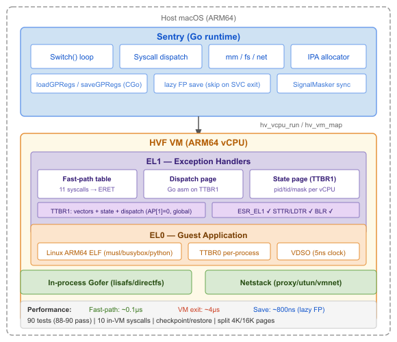
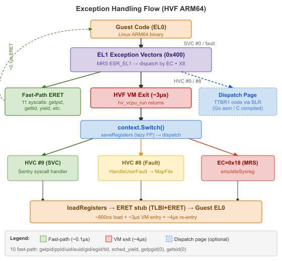

# HVF Platform (macOS)

[TOC]

The HVF platform implements gVisor's `Platform` interface using Apple's
Hypervisor.framework on macOS ARM64 (Apple Silicon). It replaces KVM, enabling
gVisor to run Linux containers on macOS without a Linux VM.

## Overview



## Comparison with KVM

| Aspect | KVM (Linux) | HVF (macOS) |
|--------|-------------|-------------|
| API | `/dev/kvm` ioctl | Hypervisor.framework C API |
| Guest mode | EL0 (user) + EL1 (kernel) | EL0 (user) + EL1 (vectors/dispatch) |
| Page tables | Managed by KVM (EPT/NPT) | Stage 1: per-MM in userspace; Stage 2: HVF |
| Syscall trap | SVC from EL0 -> EL1 vectors | SVC -> EL1 dispatch (fast-path) or HVC exit |
| Memory mapping | `KVM_SET_USER_MEMORY_REGION` | `hv_vm_map(host, ipa, size, perms)` |
| vCPU binding | Per-thread via ioctl | Per-thread via `hv_vcpu_create` |
| PSTATE | Native EL0/EL1 | EL0t (guest), EL1h (entry stub); NZCV preserved |

## Guest Execution

### EL0/EL1 Separation

The guest runs at **EL0** (user mode) with exception vectors at EL1. The vCPU
enters at EL1 to execute a TLB flush + ERET stub, which transitions to EL0 at
the guest's PC. When the guest executes SVC, it traps through the lower-EL
sync vector (offset 0x400) to an EL1 dispatch handler that handles 10
fast-path syscalls entirely in-VM without a VM exit.

```
 On vCPU entry (load):
   SPSR_EL1 = Pstate & 0xF0000000   // NZCV only, mode=EL0t (0x0), DAIF clear
   CPSR     = 0x3C5                  // EL1h + DAIF masked (entry stub)
   PC       = vectors + 0x810       // TLB flush + ERET stub

 On vCPU exit (save):
   Pstate = SPSR_EL1 & ~0x3CF       // Clear mode + DAIF (already EL0t)
   PC     = ELR_EL1                  // Guest PC at exception
   SP     = SP_EL0                   // Guest stack pointer
```

The entry stub runs at EL1 (CPSR=0x3C5) to execute TLBI, then ERETing
to EL0 at the address in ELR_EL1. SPSR_EL1 determines the target EL — mode=0x0
means EL0t.

### Exception Vectors and Fast-Path Dispatch



A shared exception vector table is mapped at IPA 0 in every address space.
The lower-EL sync vector (0x400) branches to a dispatch code page mapped in
TTBR1 (kernel VA space) that handles 10 syscalls entirely at EL1:

**Table-dispatch syscalls** (7): getpid, gettid, getuid, getgid, geteuid,
getegid, clock_gettime — return values from a per-vCPU state page.

**Extended-dispatch syscalls** (3): sched_yield, getpgid, getsid —
simple operations using EL1 register access.

Unhandled syscalls save registers to the state page via STP chain and exit
via HVC #9 for sentry dispatch.

| EC | Exception | Sentry Action |
|----|-----------|---------------|
| 0x15 | SVC (syscall) | Fast-path in EL1 or HVC #9 exit |
| 0x24 | Data abort (lower EL) | `HandleUserFault` -> page table update |
| 0x25 | Data abort (current EL) | `HandleUserFault` -> page table update |
| 0x20 | Instruction abort | `HandleUserFault` -> map code page |
| 0x18 | MSR/MRS trap | `emulateSysreg` -> ID register emulation |

A sigreturn trampoline at IPA 0x804 provides `MOV X8, #139; SVC #0` for
signal frame restoration.

## Two-Level Address Translation

 and Stage 2 (HVF).")

**Stage 1** (software, per address space): ARM64 page tables managed by
the platform via `MapFile`. Maps guest VA to IPA.

**Stage 2** (hardware, HVF): Maps IPA to host physical address. Controlled by
the IPA allocator via `hv_vm_map`. Shared across all address spaces.

### Page Table Format

Default: **4K granule**, T0SZ=16 (48-bit VA, 256TB):

- L0 table: 512 entries (VA[47:39])
- L1 table: 512 entries (VA[38:30])
- L2 table: 512 entries (VA[29:21])
- L3 table: 512 entries, 4K per page (VA[20:12])
- Descriptors: `IPA | nG | AF | SH | attr | AP[2] | table | valid`

With `--page16k`: 16K granule, 4-level walk (L0=2, L1/L2/L3=2048 entries each).

### Dual-TTBR Memory Model

TTBR0 (lower half): per-process guest memory, switched on context switch.
TTBR1 (upper half): shared sentry kernel memory (Go heap, stacks, dispatch
code, state pages). Mapped once, updated as heap grows.

### Copy-on-Write

The AP[2] bit (bit 7) in L3 entries controls write permission:
- AP[2]=0: read-write (normal pages)
- AP[2]=1: read-only (COW pages after fork)

On fork, parent pages become read-only. Write faults trigger COW:
guest faults -> `HandleUserFault` -> `breakCopyOnWriteLocked` -> allocate
new page, copy data, remap writable.

### TLB Invalidation

Non-Global (nG) bit is set on all L3 entries. Each `Switch()` increments a
16-bit ASID in TTBR0_EL1 (TCR AS=1). When the ASID changes, all nG TLB
entries from previous runs become invalid. The entry stub executes
TLBI ASIDE1IS on every guest entry for TLB coherency.

### TLB Fault Recovery (0x200 Handler)

The EL1 STP chain (saving guest GP registers to the state page) may
fault when the state page TLB entry is cold (after TLBI). The 0x200
handler (current-EL SPx sync) handles this with a zero-clobber design:

1. TLBI VMALLE1IS + DSB ISH + ISB (flush TLB)
2. ERET (retries the faulting STP)

The handler does not touch any GP register or memory. It works because
the el0_sync slow path saves guest ELR_EL1 → X17 and SPSR_EL1 → X18
**before** the STP chain begins. The current-EL exception automatically
sets ELR/SPSR to the faulting STP's address and EL1 PSTATE, which is
exactly what ERET needs to retry. X17 and X18 are already sacrificial
(clobbered by el0_sync's ESR/syscall-number check), so using them for
guest PC/PSTATE is free. After retry, the STP chain stores X17/X18 to
the state page. The sentry reads X17 from the vCPU API (guest PC) and
X18 from the state page (guest PSTATE).

HVF may also exit with EC=0x25 (current-EL data abort) instead of
routing through the 0x200 vector. The sentry handles this by
re-entering the vCPU with `skipAll`, letting the 0x200 handler
resolve the fault in-VM on the next run.

## IPA Space Layout

```
 0x00000 - 0x03FFF   Exception vectors + sigreturn trampoline (16K)
 0x10000 - 0xFFFFF   Page table pages (L0-L3, recycled via free list)
 0x1000000+           Data pages (host memory, assigned by IPA allocator)
                      First allocation: dispatch code page (16K)
                      Then: per-vCPU state pages (16K each)
                      Then: guest memory pages
```

The IPA allocator tracks allocation sizes per IPA for correct unmapping.
Multiple address spaces sharing a host page (COW) use the same IPA but with
different Stage 1 permissions (AP[2]).

### Shadow Pages

macOS can silently relocate physical pages backing file-mapped memory
without updating HVF's stage-2 tables. To prevent stale reads, guest user
pages from gofer file mappings are shadow-copied: content is copied into
anonymous memory, and the anonymous VA is passed to `hv_vm_map`. Anonymous
pages have stable physical addresses. MemoryFile pages (sentry-owned) are
mapped directly since the sentry writes to them.

## Split Page Size Model

macOS ARM64 uses 16K host pages, but Linux ARM64 universally uses 4K pages.
The port uses a split model:

- `hostarch.GuestPageSize = 4096`: VMA alignment, syscall validation, AT_PAGESZ
- `hostarch.PageSize = 16384`: PMA allocation, MemoryFile backing

The `page4KRound` shim in `sys_mmap.go` rounds 4K-aligned MAP_FIXED
addresses to 16K boundaries for the mm layer, returning the original 4K
address to the guest.

## vCPU Management

vCPUs are thread-local: each OS thread gets its own HVF vCPU (created lazily
by `machine.Get()`). vCPUs are reused across `Switch()` calls on the same
thread. The Go runtime's `LockOSThread`/`UnlockOSThread` ensures thread
affinity during guest execution.

## Networking

Three modes are supported via the `--net` flag:

| Mode | Flag | Root? | Description |
|------|------|-------|-------------|
| Proxy | `--net=proxy` | No | TCP/UDP proxy via host sockets |
| utun | `--net=utun` | Yes | L3 tunnel via macOS utun device |
| vmnet | `--net=vmnet` | No | Via `socket_vmnet` daemon |

The utun mode creates a point-to-point L3 tunnel with unique /30 subnets.
The vmnet mode uses the `socket_vmnet` daemon for rootless bridged networking.

## Checkpoint/Restore

Checkpoint/restore is supported via `kernel.SaveTo`/`kernel.LoadFrom`:

- **Save**: `--checkpoint <path>` + `kill -USR1 <pid>` saves full kernel
  state (tasks, memory, filesystem) to a single file (~83ms, ~235KB)
- **Restore**: `--restore <path> --rootfs <rootfs>` loads kernel state,
  reconnects gofer and stdio, resumes tasks (~28ms)

Key adaptations for macOS:
- `GuestPageSize` check instead of `PageSize` in SaveTo/LoadFrom
- Stateify type registration fix: `_darwin` added to OS suffix list
  in `tools/bazeldefs/tags.bzl` to prevent impossible build tag
  combinations (`linux && darwin`)
- `namespaceDefaultRefs` marked `+stateify savable` with `destroy`
  func as `state:"nosave"`
- Gofer reconnection via `CtxRestoreFilesystemFDMap`
- Stdio FD remapping on restore

## Known Limitations

- **Crypto instructions**: AES/SHA/PMULL hidden in ISAR0/HWCAP due to
  intermittent HVF EC=0 traps during OpenSSL init
- **DC ZVA**: Prohibited (DCZID DZP=1) since SCTLR DZE=0
- **Fast-path per-process**: PID/TID/UID values in shared vectors page
  are only correct for the init process
- **Fork-heavy workloads**: ~50% reliability at 50 concurrent
  fork+exit operations. HVF can reset vCPU state on cancel
  (CPSR=0x800003c5, all GP regs zeroed), causing stale register
  state in signal frames during SIGCHLD storms
- **FEX-Emu**: Blocked by Apple Silicon L3 permission upgrade hardware bug
